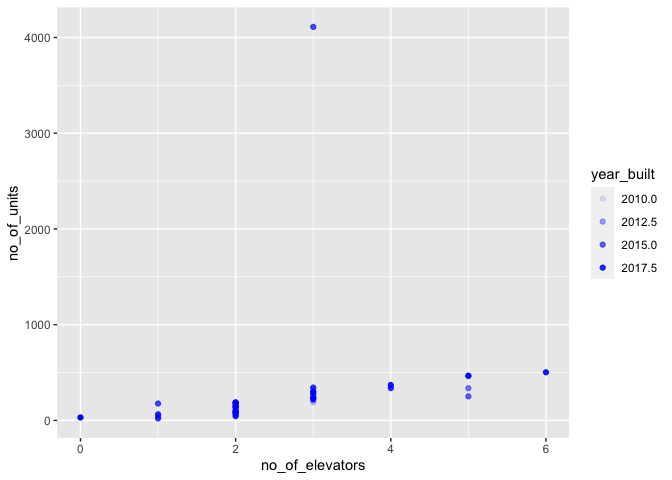

Mini Data-Analysis Deliverable 1
================
Giulia Belotti
2022-10-10

# Welcome to your (maybe) first-ever data analysis project!

And hopefully the first of many. Let’s get started:

1.  Install the [`datateachr`](https://github.com/UBC-MDS/datateachr)
    package by typing the following into your **R terminal**:

<!-- -->

    install.packages("devtools")
    devtools::install_github("UBC-MDS/datateachr")

2.  Load the packages below.

``` r
# Clean workspace; Clear console
rm(list=ls()); cat("\014") 
```



``` r
# Load packages 
library(datateachr)
library(tidyverse)
```

    ## ── Attaching packages ─────────────────────────────────────── tidyverse 1.3.2 ──
    ## ✔ ggplot2 3.3.6      ✔ purrr   0.3.4 
    ## ✔ tibble  3.1.8      ✔ dplyr   1.0.10
    ## ✔ tidyr   1.2.1      ✔ stringr 1.4.1 
    ## ✔ readr   2.1.2      ✔ forcats 0.5.2 
    ## ── Conflicts ────────────────────────────────────────── tidyverse_conflicts() ──
    ## ✖ dplyr::filter() masks stats::filter()
    ## ✖ dplyr::lag()    masks stats::lag()

3.  Make a repository in the <https://github.com/stat545ubc-2022>
    Organization. You will be working with this repository for the
    entire data analysis project. You can either make it public, or make
    it private and add the TA’s and Lucy as collaborators. A link to
    help you create a private repository is available on the
    \#collaborative-project Slack channel.

# Instructions

## For Both Milestones

-   Each milestone is worth 45 points. The number of points allocated to
    each task will be annotated within each deliverable. Tasks that are
    more challenging will often be allocated more points.

-   10 points will be allocated to the reproducibility, cleanliness, and
    coherence of the overall analysis. While the two milestones will be
    submitted as independent deliverables, the analysis itself is a
    continuum - think of it as two chapters to a story. Each chapter, or
    in this case, portion of your analysis, should be easily followed
    through by someone unfamiliar with the content.
    [Here](https://swcarpentry.github.io/r-novice-inflammation/06-best-practices-R/)
    is a good resource for what constitutes “good code”. Learning good
    coding practices early in your career will save you hassle later on!

## For Milestone 1

**To complete this milestone**, edit [this very `.Rmd`
file](https://raw.githubusercontent.com/UBC-STAT/stat545.stat.ubc.ca/master/content/mini-project/mini-project-1.Rmd)
directly. Fill in the sections that are tagged with
`<!--- start your work below --->`.

**To submit this milestone**, make sure to knit this `.Rmd` file to an
`.md` file by changing the YAML output settings from
`output: html_document` to `output: github_document`. Commit and push
all of your work to the mini-analysis GitHub repository you made
earlier, and tag a release on GitHub. Then, submit a link to your tagged
release on canvas.

**Points**: This milestone is worth 45 points: 43 for your analysis, 1
point for having your Milestone 1 document knit error-free, and 1 point
for tagging your release on Github.

# Learning Objectives

By the end of this milestone, you should:

-   Become familiar with your dataset of choosing
-   Select 4 questions that you would like to answer with your data
-   Generate a reproducible and clear report using R Markdown
-   Become familiar with manipulating and summarizing your data in
    tibbles using `dplyr`, with a research question in mind.

# Task 1: Choose your favorite dataset (10 points)

The `datateachr` package by Hayley Boyce and Jordan Bourak currently
composed of 7 semi-tidy datasets for educational purposes. Here is a
brief description of each dataset:

-   *apt_buildings*: Acquired courtesy of The City of Toronto’s Open
    Data Portal. It currently has 3455 rows and 37 columns.

-   *building_permits*: Acquired courtesy of The City of Vancouver’s
    Open Data Portal. It currently has 20680 rows and 14 columns.

-   *cancer_sample*: Acquired courtesy of UCI Machine Learning
    Repository. It currently has 569 rows and 32 columns.

-   *flow_sample*: Acquired courtesy of The Government of Canada’s
    Historical Hydrometric Database. It currently has 218 rows and 7
    columns.

-   *parking_meters*: Acquired courtesy of The City of Vancouver’s Open
    Data Portal. It currently has 10032 rows and 22 columns.

-   *steam_games*: Acquired courtesy of Kaggle. It currently has 40833
    rows and 21 columns.

-   *vancouver_trees*: Acquired courtesy of The City of Vancouver’s Open
    Data Portal. It currently has 146611 rows and 20 columns.

**Things to keep in mind**

-   We hope that this project will serve as practice for carrying our
    your own *independent* data analysis. Remember to comment your code,
    be explicit about what you are doing, and write notes in this
    markdown document when you feel that context is required. As you
    advance in the project, prompts and hints to do this will be
    diminished - it’ll be up to you!

-   Before choosing a dataset, you should always keep in mind **your
    goal**, or in other ways, *what you wish to achieve with this data*.
    This mini data-analysis project focuses on *data wrangling*,
    *tidying*, and *visualization*. In short, it’s a way for you to get
    your feet wet with exploring data on your own.

And that is exactly the first thing that you will do!

1.1 Out of the 7 datasets available in the `datateachr` package, choose
**4** that appeal to you based on their description. Write your choices
below:

**Note**: We encourage you to use the ones in the `datateachr` package,
but if you have a dataset that you’d really like to use, you can include
it here. But, please check with a member of the teaching team to see
whether the dataset is of appropriate complexity. Also, include a
**brief** description of the dataset here to help the teaching team
understand your data.

<!-------------------------- Start your work below ---------------------------->

1: apt_buildings 2: building_permits 3: parking_meters 4:
vancouver_trees

<!----------------------------------------------------------------------------->

1.2 One way to narrowing down your selection is to *explore* the
datasets. Use your knowledge of dplyr to find out at least *3*
attributes about each of these datasets (an attribute is something such
as number of rows, variables, class type…). The goal here is to have an
idea of *what the data looks like*.

*Hint:* This is one of those times when you should think about the
cleanliness of your analysis. I added a single code chunk for you below,
but do you want to use more than one? Would you like to write more
comments outside of the code chunk?

<!-------------------------- Start your work below ---------------------------->

I am now exploring the 4 datasets. To do so, I am using the print(),
glimpse(), dim(), and class() functions on all dataset. I want to see
the number of rows and columns, the variables in each dataset, and have
an idea of the overall structure of the data.

Here, I explore the apt_buildings dataset

``` r
print(apt_buildings)
```

    ## # A tibble: 3,455 × 37
    ##       id air_c…¹ ameni…² balco…³ barri…⁴ bike_…⁵ exter…⁶ fire_…⁷ garba…⁸ heati…⁹
    ##    <dbl> <chr>   <chr>   <chr>   <chr>   <chr>   <chr>   <chr>   <chr>   <chr>  
    ##  1 10359 NONE    Outdoo… YES     YES     0 indo… NO      YES     YES     HOT WA…
    ##  2 10360 NONE    Outdoo… YES     NO      0 indo… NO      YES     YES     HOT WA…
    ##  3 10361 NONE    <NA>    YES     NO      Not Av… NO      YES     NO      HOT WA…
    ##  4 10362 NONE    <NA>    YES     YES     Not Av… YES     YES     NO      HOT WA…
    ##  5 10363 NONE    <NA>    NO      NO      12 ind… NO      YES     NO      HOT WA…
    ##  6 10364 NONE    <NA>    NO      NO      Not Av… <NA>    YES     NO      HOT WA…
    ##  7 10365 NONE    <NA>    NO      YES     Not Av… NO      YES     NO      HOT WA…
    ##  8 10366 CENTRA… Indoor… YES     NO      Not Av… NO      YES     YES     HOT WA…
    ##  9 10367 NONE    <NA>    YES     YES     0 indo… NO      YES     YES     ELECTR…
    ## 10 10368 NONE    Indoor… YES     YES     Not Av… NO      YES     NO      HOT WA…
    ## # … with 3,445 more rows, 27 more variables: intercom <chr>,
    ## #   laundry_room <chr>, locker_or_storage_room <chr>, no_of_elevators <dbl>,
    ## #   parking_type <chr>, pets_allowed <chr>, prop_management_company_name <chr>,
    ## #   property_type <chr>, rsn <dbl>, separate_gas_meters <chr>,
    ## #   separate_hydro_meters <chr>, separate_water_meters <chr>,
    ## #   site_address <chr>, sprinkler_system <chr>, visitor_parking <chr>,
    ## #   ward <chr>, window_type <chr>, year_built <dbl>, year_registered <dbl>, …

``` r
glimpse(apt_buildings)
```

    ## Rows: 3,455
    ## Columns: 37
    ## $ id                               <dbl> 10359, 10360, 10361, 10362, 10363, 10…
    ## $ air_conditioning                 <chr> "NONE", "NONE", "NONE", "NONE", "NONE…
    ## $ amenities                        <chr> "Outdoor rec facilities", "Outdoor po…
    ## $ balconies                        <chr> "YES", "YES", "YES", "YES", "NO", "NO…
    ## $ barrier_free_accessibilty_entr   <chr> "YES", "NO", "NO", "YES", "NO", "NO",…
    ## $ bike_parking                     <chr> "0 indoor parking spots and 10 outdoo…
    ## $ exterior_fire_escape             <chr> "NO", "NO", "NO", "YES", "NO", NA, "N…
    ## $ fire_alarm                       <chr> "YES", "YES", "YES", "YES", "YES", "Y…
    ## $ garbage_chutes                   <chr> "YES", "YES", "NO", "NO", "NO", "NO",…
    ## $ heating_type                     <chr> "HOT WATER", "HOT WATER", "HOT WATER"…
    ## $ intercom                         <chr> "YES", "YES", "YES", "YES", "YES", "Y…
    ## $ laundry_room                     <chr> "YES", "YES", "YES", "YES", "YES", "Y…
    ## $ locker_or_storage_room           <chr> "NO", "YES", "YES", "YES", "NO", "YES…
    ## $ no_of_elevators                  <dbl> 3, 3, 0, 1, 0, 0, 0, 2, 4, 2, 0, 2, 2…
    ## $ parking_type                     <chr> "Underground Garage , Garage accessib…
    ## $ pets_allowed                     <chr> "YES", "YES", "YES", "YES", "YES", "Y…
    ## $ prop_management_company_name     <chr> NA, "SCHICKEDANZ BROS. PROPERTIES", N…
    ## $ property_type                    <chr> "PRIVATE", "PRIVATE", "PRIVATE", "PRI…
    ## $ rsn                              <dbl> 4154812, 4154815, 4155295, 4155309, 4…
    ## $ separate_gas_meters              <chr> "NO", "NO", "NO", "NO", "NO", "NO", "…
    ## $ separate_hydro_meters            <chr> "YES", "YES", "YES", "YES", "YES", "Y…
    ## $ separate_water_meters            <chr> "NO", "NO", "NO", "NO", "NO", "NO", "…
    ## $ site_address                     <chr> "65  FOREST MANOR RD", "70  CLIPPER R…
    ## $ sprinkler_system                 <chr> "YES", "YES", "NO", "YES", "NO", "NO"…
    ## $ visitor_parking                  <chr> "PAID", "FREE", "UNAVAILABLE", "UNAVA…
    ## $ ward                             <chr> "17", "17", "03", "03", "02", "02", "…
    ## $ window_type                      <chr> "DOUBLE PANE", "DOUBLE PANE", "DOUBLE…
    ## $ year_built                       <dbl> 1967, 1970, 1927, 1959, 1943, 1952, 1…
    ## $ year_registered                  <dbl> 2017, 2017, 2017, 2017, 2017, NA, 201…
    ## $ no_of_storeys                    <dbl> 17, 14, 4, 5, 4, 4, 4, 7, 32, 4, 4, 7…
    ## $ emergency_power                  <chr> "NO", "YES", "NO", "NO", "NO", "NO", …
    ## $ `non-smoking_building`           <chr> "YES", "NO", "YES", "YES", "YES", "NO…
    ## $ no_of_units                      <dbl> 218, 206, 34, 42, 25, 34, 14, 105, 57…
    ## $ no_of_accessible_parking_spaces  <dbl> 8, 10, 20, 42, 12, 0, 5, 1, 1, 6, 12,…
    ## $ facilities_available             <chr> "Recycling bins", "Green Bin / Organi…
    ## $ cooling_room                     <chr> "NO", "NO", "NO", "NO", "NO", "NO", "…
    ## $ no_barrier_free_accessible_units <dbl> 2, 0, 0, 42, 0, NA, 14, 0, 0, 1, 25, …

``` r
dim(apt_buildings)
```

    ## [1] 3455   37

``` r
class(apt_buildings)
```

    ## [1] "tbl_df"     "tbl"        "data.frame"

Here, I explore the building_permits dataset

``` r
print(building_permits)
```

    ## # A tibble: 20,680 × 14
    ##    permit_n…¹ issue_date proje…² type_…³ address proje…⁴ build…⁵ build…⁶ appli…⁷
    ##    <chr>      <date>       <dbl> <chr>   <chr>   <chr>   <chr>   <chr>   <chr>  
    ##  1 BP-2016-0… 2017-02-01  0      Salvag… 4378 W… <NA>    <NA>     <NA>   Raffae…
    ##  2 BU468090   2017-02-01  0      New Bu… 1111 R… <NA>    <NA>     <NA>   MAX KE…
    ##  3 DB-2016-0… 2017-02-01  3.5 e4 Additi… 3732 W… <NA>    <NA>     <NA>   Peter …
    ##  4 DB-2017-0… 2017-02-01  1.5 e4 Additi… 88 W P… <NA>    Mercur… "88 W … Aaron …
    ##  5 DB452250   2017-02-01  1.81e5 New Bu… 492 E … <NA>    082016… "3559 … John H…
    ##  6 BP-2016-0… 2017-02-02  0      Salvag… 3332 W… <NA>    <NA>     <NA>   Shalin…
    ##  7 BP-2016-0… 2017-02-02  1.5 e4 Demoli… 2873 W… <NA>    <NA>     <NA>   Mike C…
    ##  8 BP-2016-0… 2017-02-02  0      Salvag… 3579 E… <NA>    <NA>     <NA>   Ricci …
    ##  9 BP-2016-0… 2017-02-02  6.5 e7 New Bu… 620 CA… <NA>    <NA>     <NA>   David …
    ## 10 BP-2016-0… 2017-02-02  2.5 e4 Additi… 1868 W… <NA>    RenBui… "1868 … Daniel…
    ## # … with 20,670 more rows, 5 more variables: applicant_address <chr>,
    ## #   property_use <chr>, specific_use_category <chr>, year <dbl>, bi_id <dbl>,
    ## #   and abbreviated variable names ¹​permit_number, ²​project_value,
    ## #   ³​type_of_work, ⁴​project_description, ⁵​building_contractor,
    ## #   ⁶​building_contractor_address, ⁷​applicant

``` r
glimpse(building_permits)
```

    ## Rows: 20,680
    ## Columns: 14
    ## $ permit_number               <chr> "BP-2016-02248", "BU468090", "DB-2016-0445…
    ## $ issue_date                  <date> 2017-02-01, 2017-02-01, 2017-02-01, 2017-…
    ## $ project_value               <dbl> 0, 0, 35000, 15000, 181178, 0, 15000, 0, 6…
    ## $ type_of_work                <chr> "Salvage and Abatement", "New Building", "…
    ## $ address                     <chr> "4378 W 9TH AVENUE, Vancouver, BC V6R 2C7"…
    ## $ project_description         <chr> NA, NA, NA, NA, NA, NA, NA, NA, NA, NA, NA…
    ## $ building_contractor         <chr> NA, NA, NA, "Mercury Contracting Ltd", "08…
    ## $ building_contractor_address <chr> NA, NA, NA, "88 W PENDER ST  \r\nUnit 2069…
    ## $ applicant                   <chr> "Raffaele & Associates DBA: Raffaele and A…
    ## $ applicant_address           <chr> "2642 East Hastings\r\nVancouver, BC  V5K …
    ## $ property_use                <chr> "Dwelling Uses", "Dwelling Uses", "Dwellin…
    ## $ specific_use_category       <chr> "One-Family Dwelling", "Multiple Dwelling"…
    ## $ year                        <dbl> 2017, 2017, 2017, 2017, 2017, 2017, 2017, …
    ## $ bi_id                       <dbl> 524, 535, 539, 541, 543, 546, 547, 548, 54…

``` r
dim(building_permits)
```

    ## [1] 20680    14

``` r
class(building_permits)
```

    ## [1] "spec_tbl_df" "tbl_df"      "tbl"         "data.frame"

Here, I explore the parking_meters dataset

``` r
print(parking_meters)
```

    ## # A tibble: 10,032 × 22
    ##    meter_head  r_mf_9a…¹ r_mf_…² r_sa_…³ r_sa_…⁴ r_su_…⁵ r_su_…⁶ rate_…⁷ time_…⁸
    ##    <chr>       <chr>     <chr>   <chr>   <chr>   <chr>   <chr>   <chr>   <chr>  
    ##  1 Twin        $2.00     $4.00   $2.00   $4.00   $2.00   $4.00   <NA>    METER …
    ##  2 Pay Station $1.00     $1.00   $1.00   $1.00   $1.00   $1.00   $ .50   METER …
    ##  3 Twin        $1.00     $1.00   $1.00   $1.00   $1.00   $1.00   <NA>    METER …
    ##  4 Single      $1.00     $1.00   $1.00   $1.00   $1.00   $1.00   <NA>    METER …
    ##  5 Twin        $2.00     $1.00   $2.00   $1.00   $2.00   $1.00   <NA>    METER …
    ##  6 Twin        $2.00     $1.00   $2.00   $1.00   $2.00   $1.00   <NA>    METER …
    ##  7 Twin        $2.00     $3.00   $2.00   $3.00   $2.00   $3.00   <NA>    METER …
    ##  8 Single      $2.00     $3.00   $2.00   $3.00   $2.00   $3.00   <NA>    METER …
    ##  9 Twin        $4.00     $1.00   $4.00   $1.00   $4.00   $1.00   <NA>    METER …
    ## 10 Twin        $2.00     $1.00   $2.00   $1.00   $2.00   $1.00   <NA>    METER …
    ## # … with 10,022 more rows, 13 more variables: t_mf_9a_6p <chr>,
    ## #   t_mf_6p_10 <chr>, t_sa_9a_6p <chr>, t_sa_6p_10 <chr>, t_su_9a_6p <chr>,
    ## #   t_su_6p_10 <chr>, time_misc <chr>, credit_card <chr>, pay_phone <chr>,
    ## #   longitude <dbl>, latitude <dbl>, geo_local_area <chr>, meter_id <chr>, and
    ## #   abbreviated variable names ¹​r_mf_9a_6p, ²​r_mf_6p_10, ³​r_sa_9a_6p,
    ## #   ⁴​r_sa_6p_10, ⁵​r_su_9a_6p, ⁶​r_su_6p_10, ⁷​rate_misc, ⁸​time_in_effect

``` r
glimpse(parking_meters)
```

    ## Rows: 10,032
    ## Columns: 22
    ## $ meter_head     <chr> "Twin", "Pay Station", "Twin", "Single", "Twin", "Twin"…
    ## $ r_mf_9a_6p     <chr> "$2.00", "$1.00", "$1.00", "$1.00", "$2.00", "$2.00", "…
    ## $ r_mf_6p_10     <chr> "$4.00", "$1.00", "$1.00", "$1.00", "$1.00", "$1.00", "…
    ## $ r_sa_9a_6p     <chr> "$2.00", "$1.00", "$1.00", "$1.00", "$2.00", "$2.00", "…
    ## $ r_sa_6p_10     <chr> "$4.00", "$1.00", "$1.00", "$1.00", "$1.00", "$1.00", "…
    ## $ r_su_9a_6p     <chr> "$2.00", "$1.00", "$1.00", "$1.00", "$2.00", "$2.00", "…
    ## $ r_su_6p_10     <chr> "$4.00", "$1.00", "$1.00", "$1.00", "$1.00", "$1.00", "…
    ## $ rate_misc      <chr> NA, "$ .50", NA, NA, NA, NA, NA, NA, NA, NA, NA, NA, NA…
    ## $ time_in_effect <chr> "METER IN EFFECT: 9:00 AM TO 10:00 PM", "METER IN EFFEC…
    ## $ t_mf_9a_6p     <chr> "2 Hr", "10 Hrs", "2 Hr", "2 Hr", "2 Hr", "3 Hr", "2 Hr…
    ## $ t_mf_6p_10     <chr> "4 Hr", "10 Hrs", "4 Hr", "4 Hr", "4 Hr", "4 Hr", "4 Hr…
    ## $ t_sa_9a_6p     <chr> "2 Hr", "10 Hrs", "2 Hr", "2 Hr", "2 Hr", "3 Hr", "2 Hr…
    ## $ t_sa_6p_10     <chr> "4 Hr", "10 Hrs", "4 Hr", "4 Hr", "4 Hr", "4 Hr", "4 Hr…
    ## $ t_su_9a_6p     <chr> "2 Hr", "10 Hrs", "2 Hr", "2 Hr", "2 Hr", "3 Hr", "2 Hr…
    ## $ t_su_6p_10     <chr> "4 Hr", "10 Hrs", "4 Hr", "4 Hr", "4 Hr", "4 Hr", "4 Hr…
    ## $ time_misc      <chr> NA, "No Time Limit", NA, NA, NA, NA, NA, NA, NA, NA, NA…
    ## $ credit_card    <chr> "No", "Yes", "No", "No", "No", "No", "No", "No", "No", …
    ## $ pay_phone      <chr> "66890", "59916", "57042", "57159", "51104", "60868", "…
    ## $ longitude      <dbl> -123.1289, -123.0982, -123.1013, -123.1862, -123.1278, …
    ## $ latitude       <dbl> 49.28690, 49.27215, 49.25468, 49.26341, 49.26354, 49.27…
    ## $ geo_local_area <chr> "West End", "Strathcona", "Riley Park", "West Point Gre…
    ## $ meter_id       <chr> "670805", "471405", "C80145", "D03704", "301023", "5913…

``` r
dim(parking_meters)
```

    ## [1] 10032    22

``` r
class(parking_meters)
```

    ## [1] "tbl_df"     "tbl"        "data.frame"

Here, I explore the vancouver_trees dataset

``` r
print(vancouver_trees)
```

    ## # A tibble: 146,611 × 20
    ##    tree_id civic_number std_st…¹ genus…² speci…³ culti…⁴ commo…⁵ assig…⁶ root_…⁷
    ##      <dbl>        <dbl> <chr>    <chr>   <chr>   <chr>   <chr>   <chr>   <chr>  
    ##  1  149556          494 W 58TH … ULMUS   AMERIC… BRANDON BRANDO… N       N      
    ##  2  149563          450 W 58TH … ZELKOVA SERRATA <NA>    JAPANE… N       N      
    ##  3  149579         4994 WINDSOR… STYRAX  JAPONI… <NA>    JAPANE… N       N      
    ##  4  149590          858 E 39TH … FRAXIN… AMERIC… AUTUMN… AUTUMN… Y       N      
    ##  5  149604         5032 WINDSOR… ACER    CAMPES… <NA>    HEDGE … N       N      
    ##  6  149616          585 W 61ST … PYRUS   CALLER… CHANTI… CHANTI… N       N      
    ##  7  149617         4909 SHERBRO… ACER    PLATAN… COLUMN… COLUMN… N       N      
    ##  8  149618         4925 SHERBRO… ACER    PLATAN… COLUMN… COLUMN… N       N      
    ##  9  149619         4969 SHERBRO… ACER    PLATAN… COLUMN… COLUMN… N       N      
    ## 10  149625          720 E 39TH … FRAXIN… AMERIC… AUTUMN… AUTUMN… N       N      
    ## # … with 146,601 more rows, 11 more variables: plant_area <chr>,
    ## #   on_street_block <dbl>, on_street <chr>, neighbourhood_name <chr>,
    ## #   street_side_name <chr>, height_range_id <dbl>, diameter <dbl>, curb <chr>,
    ## #   date_planted <date>, longitude <dbl>, latitude <dbl>, and abbreviated
    ## #   variable names ¹​std_street, ²​genus_name, ³​species_name, ⁴​cultivar_name,
    ## #   ⁵​common_name, ⁶​assigned, ⁷​root_barrier

``` r
glimpse(vancouver_trees)
```

    ## Rows: 146,611
    ## Columns: 20
    ## $ tree_id            <dbl> 149556, 149563, 149579, 149590, 149604, 149616, 149…
    ## $ civic_number       <dbl> 494, 450, 4994, 858, 5032, 585, 4909, 4925, 4969, 7…
    ## $ std_street         <chr> "W 58TH AV", "W 58TH AV", "WINDSOR ST", "E 39TH AV"…
    ## $ genus_name         <chr> "ULMUS", "ZELKOVA", "STYRAX", "FRAXINUS", "ACER", "…
    ## $ species_name       <chr> "AMERICANA", "SERRATA", "JAPONICA", "AMERICANA", "C…
    ## $ cultivar_name      <chr> "BRANDON", NA, NA, "AUTUMN APPLAUSE", NA, "CHANTICL…
    ## $ common_name        <chr> "BRANDON ELM", "JAPANESE ZELKOVA", "JAPANESE SNOWBE…
    ## $ assigned           <chr> "N", "N", "N", "Y", "N", "N", "N", "N", "N", "N", "…
    ## $ root_barrier       <chr> "N", "N", "N", "N", "N", "N", "N", "N", "N", "N", "…
    ## $ plant_area         <chr> "N", "N", "4", "4", "4", "B", "6", "6", "3", "3", "…
    ## $ on_street_block    <dbl> 400, 400, 4900, 800, 5000, 500, 4900, 4900, 4900, 7…
    ## $ on_street          <chr> "W 58TH AV", "W 58TH AV", "WINDSOR ST", "E 39TH AV"…
    ## $ neighbourhood_name <chr> "MARPOLE", "MARPOLE", "KENSINGTON-CEDAR COTTAGE", "…
    ## $ street_side_name   <chr> "EVEN", "EVEN", "EVEN", "EVEN", "EVEN", "ODD", "ODD…
    ## $ height_range_id    <dbl> 2, 4, 3, 4, 2, 2, 3, 3, 2, 2, 2, 5, 3, 2, 2, 2, 2, …
    ## $ diameter           <dbl> 10.00, 10.00, 4.00, 18.00, 9.00, 5.00, 15.00, 14.00…
    ## $ curb               <chr> "N", "N", "Y", "Y", "Y", "Y", "Y", "Y", "Y", "Y", "…
    ## $ date_planted       <date> 1999-01-13, 1996-05-31, 1993-11-22, 1996-04-29, 19…
    ## $ longitude          <dbl> -123.1161, -123.1147, -123.0846, -123.0870, -123.08…
    ## $ latitude           <dbl> 49.21776, 49.21776, 49.23938, 49.23469, 49.23894, 4…

``` r
dim(vancouver_trees)
```

    ## [1] 146611     20

``` r
class(vancouver_trees)
```

    ## [1] "tbl_df"     "tbl"        "data.frame"

Now I know the number of rows, the number of columns, the class type,
and the variables associated with each dataset.
<!----------------------------------------------------------------------------->

1.3 Now that you’ve explored the 4 datasets that you were initially most
interested in, let’s narrow it down to 2. What lead you to choose these
2? Briefly explain your choices below, and feel free to include any code
in your explanation.

``` r
apt_buildings %>%
  select(c(heating_type, bike_parking, no_of_storeys, no_of_units, parking_type)) %>%
  print(n = 50)
```

    ## # A tibble: 3,455 × 5
    ##    heating_type   bike_parking                           no_of…¹ no_of…² parki…³
    ##    <chr>          <chr>                                    <dbl>   <dbl> <chr>  
    ##  1 HOT WATER      0 indoor parking spots and 10 outdoor…      17     218 Underg…
    ##  2 HOT WATER      0 indoor parking spots and 34 outdoor…      14     206 Underg…
    ##  3 HOT WATER      Not Available                                4      34 Underg…
    ##  4 HOT WATER      Not Available                                5      42 Ground…
    ##  5 HOT WATER      12 indoor parking spots and 0 outdoor…       4      25 Underg…
    ##  6 HOT WATER      Not Available                                4      34 Ground…
    ##  7 HOT WATER      Not Available                                4      14 Surfac…
    ##  8 HOT WATER      Not Available                                7     105 Underg…
    ##  9 ELECTRIC       0 indoor parking spots and 15 outdoor…      32     571 Underg…
    ## 10 HOT WATER      Not Available                                4     171 Surfac…
    ## 11 HOT WATER      Not Available                                4      26 Underg…
    ## 12 HOT WATER      Not Available                                7     169 Ground…
    ## 13 HOT WATER      Not Available                                5      87 Surfac…
    ## 14 HOT WATER      0 indoor parking spots and 0 outdoor …       6      79 Ground…
    ## 15 HOT WATER      Not Available                                7      71 Ground…
    ## 16 HOT WATER      Not Available                                3      12 Ground…
    ## 17 HOT WATER      Not Available                               10     105 Underg…
    ## 18 HOT WATER      Not Available                                3      12 Ground…
    ## 19 HOT WATER      Not Available                               12     235 Underg…
    ## 20 HOT WATER      0 indoor parking spots and 7 outdoor …       4      44 Underg…
    ## 21 HOT WATER      Not Available                               18     287 Underg…
    ## 22 HOT WATER      Not Available                                3      15 Ground…
    ## 23 HOT WATER      Not Available                                7      61 Underg…
    ## 24 HOT WATER      8 indoor parking spots and 0 outdoor …       3      11 Surfac…
    ## 25 HOT WATER      Not Available                               15     146 Underg…
    ## 26 HOT WATER      Not Available                               12      88 Underg…
    ## 27 FORCED AIR GAS Not Available                                6     106 Underg…
    ## 28 HOT WATER      12 indoor parking spots and 90 outdoo…       9     116 Underg…
    ## 29 HOT WATER      Not Available                                8      77 Underg…
    ## 30 HOT WATER      Not Available                               20     161 Underg…
    ## 31 HOT WATER      0 indoor parking spots and 18 outdoor…       3      17 Ground…
    ## 32 HOT WATER      Not Available                                3      11 Ground…
    ## 33 HOT WATER      75 indoor parking spots and 0 outdoor…      19     244 Underg…
    ## 34 HOT WATER      71 indoor parking spots and 0 outdoor…      10     153 Underg…
    ## 35 HOT WATER      36 indoor parking spots and 0 outdoor…      10     117 Underg…
    ## 36 ELECTRIC       Not Available                               16     255 Underg…
    ## 37 HOT WATER      Not Available                               21     237 Underg…
    ## 38 HOT WATER      Not Available                               14     301 Surfac…
    ## 39 HOT WATER      Not Available                                4      39 Surfac…
    ## 40 HOT WATER      Not Available                                3      17 Surfac…
    ## 41 <NA>           indoor parking spots and  outdoor par…       4      25 <NA>   
    ## 42 FORCED AIR GAS 16 indoor parking spots and 16 outdoo…       3      15 Surfac…
    ## 43 HOT WATER      0 indoor parking spots and 9 outdoor …       3      22 Ground…
    ## 44 HOT WATER      Not Available                               24     184 Underg…
    ## 45 HOT WATER      Not Available                                4      25 Underg…
    ## 46 HOT WATER      0 indoor parking spots and 4 outdoor …       3      24 Ground…
    ## 47 HOT WATER      indoor parking spots and  outdoor par…      13     207 Underg…
    ## 48 HOT WATER      Not Available                                7      58 Surfac…
    ## 49 ELECTRIC       Not Available                               19     176 Underg…
    ## 50 HOT WATER      Not Available                                4      40 Carpor…
    ## # … with 3,405 more rows, and abbreviated variable names ¹​no_of_storeys,
    ## #   ²​no_of_units, ³​parking_type

``` r
building_permits %>%
  select(c(project_value, type_of_work, property_use, specific_use_category)) %>% 
  print(n = 50)
```

    ## # A tibble: 20,680 × 4
    ##    project_value type_of_work                property_use                speci…¹
    ##            <dbl> <chr>                       <chr>                       <chr>  
    ##  1             0 Salvage and Abatement       Dwelling Uses               One-Fa…
    ##  2             0 New Building                Dwelling Uses               Multip…
    ##  3         35000 Addition / Alteration       Dwelling Uses               One-Fa…
    ##  4         15000 Addition / Alteration       Office Uses,Retail Uses     Genera…
    ##  5        181178 New Building                Dwelling Uses               Lanewa…
    ##  6             0 Salvage and Abatement       Dwelling Uses               One-fa…
    ##  7         15000 Demolition / Deconstruction Dwelling Uses               One-Fa…
    ##  8             0 Salvage and Abatement       Dwelling Uses               One-Fa…
    ##  9      65000000 New Building                Dwelling Uses,Retail Uses   Multip…
    ## 10         25000 Addition / Alteration       Dwelling Uses               Multip…
    ## 11         25750 Addition / Alteration       Dwelling Uses               Multip…
    ## 12         44000 Addition / Alteration       Service Uses                Repair…
    ## 13        200000 Addition / Alteration       Dwelling Uses               One-fa…
    ## 14          4800 Addition / Alteration       Dwelling Uses               One-Fa…
    ## 15         50000 Addition / Alteration       Service Uses                Animal…
    ## 16        160000 Addition / Alteration       Institutional Uses          Hospit…
    ## 17         60000 Addition / Alteration       Dwelling Uses               One-Fa…
    ## 18       1043345 New Building                Dwelling Uses               One-fa…
    ## 19         15000 Demolition / Deconstruction Dwelling Uses               One-Fa…
    ## 20             0 Salvage and Abatement       Dwelling Uses               One-Fa…
    ## 21             0 Salvage and Abatement       Dwelling Uses               One-fa…
    ## 22             0 Salvage and Abatement       Dwelling Uses               One-fa…
    ## 23             0 Salvage and Abatement       Dwelling Uses               One-fa…
    ## 24             0 Salvage and Abatement       Dwelling Uses               One-Fa…
    ## 25             0 Salvage and Abatement       Dwelling Uses               One-fa…
    ## 26             0 Salvage and Abatement       Dwelling Uses               One-Fa…
    ## 27             0 Salvage and Abatement       Dwelling Uses               One-fa…
    ## 28         15000 Demolition / Deconstruction Dwelling Uses               One-Fa…
    ## 29             0 Salvage and Abatement       Dwelling Uses               One-fa…
    ## 30             0 Salvage and Abatement       Dwelling Uses               One-fa…
    ## 31         13000 Addition / Alteration       Service Uses                Motor …
    ## 32         25000 Addition / Alteration       Dwelling Uses               Multip…
    ## 33         70000 Addition / Alteration       Dwelling Uses               Multip…
    ## 34        100000 Addition / Alteration       Dwelling Uses               Multip…
    ## 35        100000 Addition / Alteration       Dwelling Uses               Two-Fa…
    ## 36         15000 Demolition / Deconstruction Dwelling Uses               One-Fa…
    ## 37        189900 New Building                Dwelling Uses               Lanewa…
    ## 38         25000 Addition / Alteration       Service Uses                Beauty…
    ## 39        250000 Addition / Alteration       Service Uses                Motor …
    ## 40             0 Salvage and Abatement       Dwelling Uses               One-fa…
    ## 41             0 Salvage and Abatement       Dwelling Uses               One-fa…
    ## 42             0 Salvage and Abatement       Dwelling Uses               One-fa…
    ## 43             0 Salvage and Abatement       Dwelling Uses               One-Fa…
    ## 44          5000 Addition / Alteration       Transportation and Storage… Storag…
    ## 45        238700 New Building                Dwelling Uses               Lanewa…
    ## 46       3380000 Addition / Alteration       Dwelling Uses               One-Fa…
    ## 47            NA Salvage and Abatement       Dwelling Uses               One-fa…
    ## 48             0 Salvage and Abatement       Dwelling Uses               One-Fa…
    ## 49             0 Salvage and Abatement       Dwelling Uses               One-Fa…
    ## 50             0 Salvage and Abatement       Dwelling Uses               One-fa…
    ## # … with 20,630 more rows, and abbreviated variable name ¹​specific_use_category

``` r
parking_meters %>%
  select(c(r_mf_9a_6p, credit_card, pay_phone, geo_local_area)) %>%
  print(n = 50)
```

    ## # A tibble: 10,032 × 4
    ##    r_mf_9a_6p credit_card pay_phone geo_local_area    
    ##    <chr>      <chr>       <chr>     <chr>             
    ##  1 $2.00      No          66890     West End          
    ##  2 $1.00      Yes         59916     Strathcona        
    ##  3 $1.00      No          57042     Riley Park        
    ##  4 $1.00      No          57159     West Point Grey   
    ##  5 $2.00      No          51104     Fairview          
    ##  6 $2.00      No          60868     Downtown          
    ##  7 $2.00      No          60810     Downtown          
    ##  8 $2.00      No          60577     Downtown          
    ##  9 $4.00      No          52884     Fairview          
    ## 10 $2.00      No          66822     Downtown          
    ## 11 $2.00      No          66848     Downtown          
    ## 12 $2.00      No          66815     Downtown          
    ## 13 $2.00      Yes         66219     West End          
    ## 14 $1.00      No          52340     South Cambie      
    ## 15 $1.00      Yes         59929     Riley Park        
    ## 16 $4.00      No          54667     Kitsilano         
    ## 17 $4.00      No          50212     Fairview          
    ## 18 $4.00      No          51700     Fairview          
    ## 19 $4.00      No          51728     Fairview          
    ## 20 $1.00      No          52409     Fairview          
    ## 21 $5.00      No          52743     Fairview          
    ## 22 $2.00      No          52441     Fairview          
    ## 23 $3.00      No          65877     Downtown          
    ## 24 $3.00      No          54200     Kitsilano         
    ## 25 $3.00      No          54199     Kitsilano         
    ## 26 $4.00      No          52993     Fairview          
    ## 27 $4.00      No          52882     Fairview          
    ## 28 $1.00      No          54288     Fairview          
    ## 29 $1.00      No          56653     Riley Park        
    ## 30 $1.00      No          56212     Mount Pleasant    
    ## 31 $1.00      No          52094     Fairview          
    ## 32 $3.00      No          64215     West End          
    ## 33 $3.00      No          52796     Mount Pleasant    
    ## 34 $4.00      No          52546     Kitsilano         
    ## 35 $7.00      Yes         62948     Downtown          
    ## 36 $3.00      No          52252     Grandview-Woodland
    ## 37 $3.00      No          53695     Grandview-Woodland
    ## 38 $3.00      No          53724     Grandview-Woodland
    ## 39 $2.00      No          50270     Mount Pleasant    
    ## 40 $3.00      No          60595     Downtown          
    ## 41 $3.00      No          60287     Downtown          
    ## 42 $3.00      No          61008     Downtown          
    ## 43 $1.00      No          60737     Downtown          
    ## 44 $1.00      No          57165     Mount Pleasant    
    ## 45 $1.00      No          60569     Downtown          
    ## 46 $2.00      No          54318     Mount Pleasant    
    ## 47 $1.00      No          64907     Downtown          
    ## 48 $1.00      No          53635     Kitsilano         
    ## 49 $2.00      No          54812     Fairview          
    ## 50 $1.00      No          57777     Mount Pleasant    
    ## # … with 9,982 more rows

``` r
vancouver_trees %>%
  select(c(common_name, on_street, neighbourhood_name, height_range_id, date_planted)) %>%
  print(n = 50)
```

    ## # A tibble: 146,611 × 5
    ##    common_name                    on_street        neighbou…¹ heigh…² date_pla…³
    ##    <chr>                          <chr>            <chr>        <dbl> <date>    
    ##  1 BRANDON ELM                    W 58TH AV        MARPOLE          2 1999-01-13
    ##  2 JAPANESE ZELKOVA               W 58TH AV        MARPOLE          4 1996-05-31
    ##  3 JAPANESE SNOWBELL              WINDSOR ST       KENSINGTO…       3 1993-11-22
    ##  4 AUTUMN APPLAUSE ASH            E 39TH AV        KENSINGTO…       4 1996-04-29
    ##  5 HEDGE MAPLE                    WINDSOR ST       KENSINGTO…       2 1993-12-17
    ##  6 CHANTICLEER PEAR               W 61ST AV        MARPOLE          2 NA        
    ##  7 COLUMNAR NORWAY MAPLE          SHERBROOKE ST    KENSINGTO…       3 1993-12-16
    ##  8 COLUMNAR NORWAY MAPLE          SHERBROOKE ST    KENSINGTO…       3 1993-12-16
    ##  9 COLUMNAR NORWAY MAPLE          SHERBROOKE ST    KENSINGTO…       2 1993-12-16
    ## 10 AUTUMN APPLAUSE ASH            E 39TH AV        KENSINGTO…       2 1993-12-03
    ## 11 CRIMEAN LINDEN                 E 39TH AV        KENSINGTO…       2 1993-12-03
    ## 12 CRIMEAN LINDEN                 E 39TH AV        KENSINGTO…       5 1993-12-03
    ## 13 COLUMNAR NORWAY MAPLE          SELKIRK ST       OAKRIDGE         3 1993-12-15
    ## 14 ROSE OF SHARON                 E 16TH AV        MOUNT PLE…       2 1993-11-19
    ## 15 JAPANESE SNOWBELL              E 16TH AV        MOUNT PLE…       2 1993-11-19
    ## 16 JAPANESE SNOWBELL              WINDSOR ST       KENSINGTO…       2 1993-12-21
    ## 17 RAYWOOD ASH                    WINDSOR ST       KENSINGTO…       2 1993-12-20
    ## 18 HEDGE MAPLE                    WINDSOR ST       KENSINGTO…       2 1993-12-20
    ## 19 COLUMNAR NORWAY MAPLE          SELKIRK ST       OAKRIDGE         3 1993-12-15
    ## 20 COLUMNAR NORWAY MAPLE          SELKIRK ST       OAKRIDGE         2 1993-12-15
    ## 21 HEDGE MAPLE                    WINDSOR ST       KENSINGTO…       2 1993-12-15
    ## 22 COLUMNAR NORWAY MAPLE          HUDSON ST        OAKRIDGE         3 1993-12-09
    ## 23 AMERICAN SWEETGUM              CLARENDON ST     RENFREW-C…       2 1997-04-23
    ## 24 KWANZAN FLOWERING CHERRY       CAROLINA ST      RILEY PARK       2 NA        
    ## 25 KWANZAN FLOWERING CHERRY       CAROLINA ST      RILEY PARK       2 NA        
    ## 26 EUROPEAN HORNBEAM              SMITHE ST        DOWNTOWN         4 NA        
    ## 27 SAWTOOTH OAK                   INVERNESS ST     SUNSET           4 1998-02-11
    ## 28 SAWTOOTH OAK                   INVERNESS ST     SUNSET           4 1998-02-11
    ## 29 RED MAPLE                      CARRALL ST       DOWNTOWN         3 NA        
    ## 30 RED MAPLE                      CARRALL ST       DOWNTOWN         5 NA        
    ## 31 KWANZAN FLOWERING CHERRY       CAROLINA ST      RILEY PARK       2 NA        
    ## 32 KWANZAN FLOWERING CHERRY       CAROLINA ST      RILEY PARK       2 NA        
    ## 33 MAPLE SPECIES                  BALSAM ST        ARBUTUS-R…       2 NA        
    ## 34 NORWAY MAPLE                   WILLIAM ST       GRANDVIEW…       3 NA        
    ## 35 NORWAY MAPLE                   WILLIAM ST       GRANDVIEW…       3 NA        
    ## 36 NIGHT PURPLE LEAF PLUM         CYPRESS ST       KITSILANO        1 2000-01-21
    ## 37 ENGLISH HAWTHORN               NICOLA ST        WEST END         3 NA        
    ## 38 ENGLISH HAWTHORN               NICOLA ST        WEST END         3 NA        
    ## 39 ENGLISH HAWTHORN               NICOLA ST        WEST END         2 NA        
    ## 40 ENGLISH HAWTHORN               NICOLA ST        WEST END         3 NA        
    ## 41 JAPANESE SNOWBELL              MCRAE AV         SHAUGHNES…       2 1996-12-18
    ## 42 BRANDON ELM                    LARCH ST         KITSILANO        4 2000-01-21
    ## 43 BLACK LOCUST                   BROUGHTON ST     WEST END         2 1999-02-05
    ## 44 PERSIAN IRONWOOD               KITCHENER ST     HASTINGS-…       1 2016-04-20
    ## 45 JAPANESE DOGWOOD               W 57TH AV        KERRISDALE       2 1997-01-22
    ## 46 CHANTICLEER PEAR               W 12TH AV        WEST POIN…       2 1997-01-31
    ## 47 KOBUS MAGNOLIA                 COURTENAY ST     WEST POIN…       2 1997-01-23
    ## 48 FREEMAN'S S.S. MAPLE           BALSAM ST        KITSILANO        2 1997-03-20
    ## 49 KARPICK RED MAPLE              W 15TH AV        KITSILANO        4 1996-04-16
    ## 50 SILVER VARIEGATED NORWAY MAPLE TO BE DETERMINED MOUNT PLE…       4 NA        
    ## # … with 146,561 more rows, and abbreviated variable names ¹​neighbourhood_name,
    ## #   ²​height_range_id, ³​date_planted

After exploring the 4 datasets, I find the “apt_buildings” and the
“building_permits” dataset the most interesting ones. I came to this
conclusion after further exploring the datasets, this time by selecting
one or more variables of interest. I found the observations associated
with one or more variables of some datasets more interesting than others
and therefore I decided to pick those, since they will make it easier
for me to identify one (or more) research question(s).

1.4 Time for the final decision! Going back to the beginning, it’s
important to have an *end goal* in mind. For example, if I had chosen
the `titanic` dataset for my project, I might’ve wanted to explore the
relationship between survival and other variables. Try to think of 1
research question that you would want to answer with each dataset. Note
them down below, and make your final choice based on what seems more
interesting to you!

<!-------------------------- Start your work below ---------------------------->

I am now going to try to identify 1 research question for each dataset
initially selected and I will eventually identify the most interesting
research question, which will allow me to choose the dataset I want to
work with for this mini data analysis.

For the apt_buildings dataset, I have identified the following research
question: - What can the features of the various apartment buindings in
the city of Toronto tell us about livability, accessibility, and
affordability of the city?

For the building_permits dataset, I have identified the following
research question: - What is the primary use category of new buildings
in Vancouver?

For the parking_meters dataset, I have identified the following research
question: - In what areas of the city is parking more expensive?

For the vancouver_trees dataset, I have identified the following
research question: - What is the Vancouver neighborhood where most new
trees are being planted?

After trying to identify a research question for each dataset, I decided
to work with the apt_buildings dataset, since it will allow me to
explore an area of interest - the urban environment.

\# Important note

Read Tasks 2 and 3 *fully* before starting to complete either of them.
Probably also a good point to grab a coffee to get ready for the fun
part!

This project is semi-guided, but meant to be *independent*. For this
reason, you will complete tasks 2 and 3 below (under the **START HERE**
mark) as if you were writing your own exploratory data analysis report,
and this guidance never existed! Feel free to add a brief introduction
section to your project, format the document with markdown syntax as you
deem appropriate, and structure the analysis as you deem appropriate.
Remember, marks will be awarded for completion of the 4 tasks, but 10
points of the whole project are allocated to a reproducible and clean
analysis. If you feel lost, you can find a sample data analysis
[here](https://www.kaggle.com/headsortails/tidy-titarnic) to have a
better idea. However, bear in mind that it is **just an example** and
you will not be required to have that level of complexity in your
project.

# Task 2: Exploring your dataset (15 points)

If we rewind and go back to the learning objectives, you’ll see that by
the end of this deliverable, you should have formulated *4* research
questions about your data that you may want to answer during your
project. However, it may be handy to do some more exploration on your
dataset of choice before creating these questions - by looking at the
data, you may get more ideas. **Before you start this task, read all
instructions carefully until you reach START HERE under Task 3**.

2.1 Complete *4 out of the following 8 exercises* to dive deeper into
your data. All datasets are different and therefore, not all of these
tasks may make sense for your data - which is why you should only answer
*4*. Use *dplyr* and *ggplot*.

1.  Plot the distribution of a numeric variable.
2.  Create a new variable based on other variables in your data (only if
    it makes sense)
3.  Investigate how many missing values there are per variable. Can you
    find a way to plot this?
4.  Explore the relationship between 2 variables in a plot.
5.  Filter observations in your data according to your own criteria.
    Think of what you’d like to explore - again, if this was the
    `titanic` dataset, I may want to narrow my search down to passengers
    born in a particular year…
6.  Use a boxplot to look at the frequency of different observations
    within a single variable. You can do this for more than one variable
    if you wish!
7.  Make a new tibble with a subset of your data, with variables and
    observations that you are interested in exploring.
8.  Use a density plot to explore any of your variables (that are
    suitable for this type of plot).

2.2 For each of the 4 exercises that you complete, provide a *brief
explanation* of why you chose that exercise in relation to your data (in
other words, why does it make sense to do that?), and sufficient
comments for a reader to understand your reasoning and code.

# <!-------------------------- Start your work below ---------------------------->

Exercise 2. Create a new variable based on other variables in your data
(only if it makes sense)

To start exploring my data, I would like to know more about the ratio
between the number of storeys in a certain building and the number of
elevators in the same building. For this reason, I am creating a new
variable by using the function mutate(). I am calling the new variable
“ratio_elev_storeys”, which is the result of the number of storeys
divided by the number of elevators in each building in the dataset. I am
then selecting the new variable created and then everything else to be
able to immediately visualize the ratio in my dataset.

``` r
mutate(apt_buildings, ratio_elev_storeys = no_of_storeys/no_of_elevators) %>%
select(ratio_elev_storeys, everything())
```

    ## # A tibble: 3,455 × 38
    ##    ratio…¹    id air_c…² ameni…³ balco…⁴ barri…⁵ bike_…⁶ exter…⁷ fire_…⁸ garba…⁹
    ##      <dbl> <dbl> <chr>   <chr>   <chr>   <chr>   <chr>   <chr>   <chr>   <chr>  
    ##  1    5.67 10359 NONE    Outdoo… YES     YES     0 indo… NO      YES     YES    
    ##  2    4.67 10360 NONE    Outdoo… YES     NO      0 indo… NO      YES     YES    
    ##  3  Inf    10361 NONE    <NA>    YES     NO      Not Av… NO      YES     NO     
    ##  4    5    10362 NONE    <NA>    YES     YES     Not Av… YES     YES     NO     
    ##  5  Inf    10363 NONE    <NA>    NO      NO      12 ind… NO      YES     NO     
    ##  6  Inf    10364 NONE    <NA>    NO      NO      Not Av… <NA>    YES     NO     
    ##  7  Inf    10365 NONE    <NA>    NO      YES     Not Av… NO      YES     NO     
    ##  8    3.5  10366 CENTRA… Indoor… YES     NO      Not Av… NO      YES     YES    
    ##  9    8    10367 NONE    <NA>    YES     YES     0 indo… NO      YES     YES    
    ## 10    2    10368 NONE    Indoor… YES     YES     Not Av… NO      YES     NO     
    ## # … with 3,445 more rows, 28 more variables: heating_type <chr>,
    ## #   intercom <chr>, laundry_room <chr>, locker_or_storage_room <chr>,
    ## #   no_of_elevators <dbl>, parking_type <chr>, pets_allowed <chr>,
    ## #   prop_management_company_name <chr>, property_type <chr>, rsn <dbl>,
    ## #   separate_gas_meters <chr>, separate_hydro_meters <chr>,
    ## #   separate_water_meters <chr>, site_address <chr>, sprinkler_system <chr>,
    ## #   visitor_parking <chr>, ward <chr>, window_type <chr>, year_built <dbl>, …

Exercise 3. Investigate how many missing values there are per variable.
Can you find a way to plot this?

Following is the first operation I ran in order to find the missing
values per each variable. Although I thought there must be a way to do
this more easily, I started by taking every single variable and finding
the number of missing values in every single one of them.

``` r
sum(is.na(apt_buildings$amenities))
```

    ## [1] 2518

``` r
sum(is.na(apt_buildings$balconies))
```

    ## [1] 88

``` r
sum(is.na(apt_buildings$barrier_free_accessibilty_entr))
```

    ## [1] 82

``` r
sum(is.na(apt_buildings$bike_parking))
```

    ## [1] 0

``` r
sum(is.na(apt_buildings$exterior_fire_escape))
```

    ## [1] 95

``` r
sum(is.na(apt_buildings$fire_alarm))
```

    ## [1] 87

``` r
sum(is.na(apt_buildings$garbage_chutes))
```

    ## [1] 83

``` r
sum(is.na(apt_buildings$heating_type))
```

    ## [1] 86

``` r
sum(is.na(apt_buildings$intercom))
```

    ## [1] 90

``` r
sum(is.na(apt_buildings$laundry_room))
```

    ## [1] 85

``` r
sum(is.na(apt_buildings$locker_or_storage_room))
```

    ## [1] 88

``` r
sum(is.na(apt_buildings$no_of_elevators))
```

    ## [1] 5

``` r
sum(is.na(apt_buildings$parking_type))
```

    ## [1] 350

``` r
sum(is.na(apt_buildings$pets_allowed))
```

    ## [1] 90

``` r
sum(is.na(apt_buildings$prop_management_company_name))
```

    ## [1] 1363

``` r
sum(is.na(apt_buildings$property_type))
```

    ## [1] 0

``` r
sum(is.na(apt_buildings$rsn))
```

    ## [1] 0

``` r
sum(is.na(apt_buildings$separate_gas_meters))
```

    ## [1] 88

``` r
sum(is.na(apt_buildings$separate_hydro_meters))
```

    ## [1] 87

``` r
sum(is.na(apt_buildings$separate_water_meters))
```

    ## [1] 87

``` r
sum(is.na(apt_buildings$site_address))
```

    ## [1] 0

``` r
sum(is.na(apt_buildings$sprinkler_system))
```

    ## [1] 87

``` r
sum(is.na(apt_buildings$visitor_parking))
```

    ## [1] 87

``` r
sum(is.na(apt_buildings$ward))
```

    ## [1] 0

``` r
sum(is.na(apt_buildings$window_type))
```

    ## [1] 8

``` r
sum(is.na(apt_buildings$year_built))
```

    ## [1] 13

``` r
sum(is.na(apt_buildings$year_registered))
```

    ## [1] 89

``` r
sum(is.na(apt_buildings$no_of_storeys))
```

    ## [1] 0

``` r
sum(is.na(apt_buildings$emergency_power))
```

    ## [1] 86

``` r
sum(is.na(apt_buildings$no_of_units))
```

    ## [1] 0

``` r
sum(is.na(apt_buildings$no_of_accessible_parking_spaces))
```

    ## [1] 123

``` r
sum(is.na(apt_buildings$facilities_available))
```

    ## [1] 0

``` r
sum(is.na(apt_buildings$cooling_room))
```

    ## [1] 88

``` r
sum(is.na(apt_buildings$no_barrier_free_accessible_units))
```

    ## [1] 154

By running this function for each variable, I found that some variables
(bike_parking, property_type, rsn, site_address, ward, no_of_storeys,
no_of_units and facilities_available) do not have any missing values.

Nonetheless, I found this way of finding missing values extremely
inefficient, therefore I tried to apply a different code to find missing
values. Following, the code I used to find missing values for each
variable in a more efficient way:

``` r
missing.values <- apt_buildings %>%
    gather(key = "key", value = "val") %>%
    mutate(is.missing = is.na(val)) %>%
    group_by(key, is.missing) %>%
    summarise(num.missing = n()) %>%
    filter(is.missing==T) %>%
    select(-is.missing) %>%
    arrange(desc(num.missing)) 
```

    ## `summarise()` has grouped output by 'key'. You can override using the `.groups`
    ## argument.

``` r
missing.values
```

    ## # A tibble: 28 × 2
    ## # Groups:   key [28]
    ##    key                              num.missing
    ##    <chr>                                  <int>
    ##  1 amenities                               2518
    ##  2 prop_management_company_name            1363
    ##  3 parking_type                             350
    ##  4 no_barrier_free_accessible_units         154
    ##  5 no_of_accessible_parking_spaces          123
    ##  6 exterior_fire_escape                      95
    ##  7 non-smoking_building                      94
    ##  8 intercom                                  90
    ##  9 pets_allowed                              90
    ## 10 year_registered                           89
    ## # … with 18 more rows

I will now plot try to plot the number of missing values as follows:

``` r
missing.values %>%
  ggplot() +
    geom_bar(aes(x=key, y=num.missing), stat = 'identity') +
    labs(x='variable', y="number of missing values", title='Number of missing values') +
  theme(axis.text.x = element_text(angle = 45, hjust = 1))
```

<!-- -->

As we can see, it is easier to determine which variables have more
missing values graphically - the variables “amenities” and
“management_company_name” have a high number of missing values compared
to other variables.

Exercise 5. Filter observations in your data according to your own
criteria. Think of what you’d like to explore.

``` r
apt_buildings %>% 
  filter(year_built %in% c("1980":"2019")) %>%
  select(year_built, everything())
```

    ## # A tibble: 420 × 37
    ##    year_…¹    id air_c…² ameni…³ balco…⁴ barri…⁵ bike_…⁶ exter…⁷ fire_…⁸ garba…⁹
    ##      <dbl> <dbl> <chr>   <chr>   <chr>   <chr>   <chr>   <chr>   <chr>   <chr>  
    ##  1    1994 10385 NONE    <NA>    YES     YES     Not Av… NO      YES     YES    
    ##  2    2005 10386 NONE    Indoor… YES     NO      12 ind… NO      YES     YES    
    ##  3    1992 10389 NONE    <NA>    YES     YES     0 indo… NO      YES     NO     
    ##  4    2011 10392 CENTRA… Indoor… YES     YES     71 ind… NO      YES     YES    
    ##  5    1980 10396 NONE    Indoor… YES     YES     Not Av… NO      YES     YES    
    ##  6    1984 10407 NONE    <NA>    NO      YES     Not Av… NO      YES     YES    
    ##  7    1995 10426 CENTRA… Indoor… YES     YES     40 ind… NO      YES     YES    
    ##  8    1994 10438 NONE    Indoor… NO      YES     Not Av… NO      YES     YES    
    ##  9    1994 10444 NONE    <NA>    YES     YES     Not Av… NO      YES     NO     
    ## 10    1986 10446 NONE    Outdoo… YES     NO      45 ind… NO      YES     YES    
    ## # … with 410 more rows, 27 more variables: heating_type <chr>, intercom <chr>,
    ## #   laundry_room <chr>, locker_or_storage_room <chr>, no_of_elevators <dbl>,
    ## #   parking_type <chr>, pets_allowed <chr>, prop_management_company_name <chr>,
    ## #   property_type <chr>, rsn <dbl>, separate_gas_meters <chr>,
    ## #   separate_hydro_meters <chr>, separate_water_meters <chr>,
    ## #   site_address <chr>, sprinkler_system <chr>, visitor_parking <chr>,
    ## #   ward <chr>, window_type <chr>, year_registered <dbl>, …

Here, I decided to filter observations by the variable “year_built” and
I only considered apartments built between 1980 and 2019. In fact, I am
not particularly interested in observations before 1980.

Exercise 7. Make a new tibble with a subset of your data, with variables
and observations that you are interested in exploring.

``` r
apt_buildings_2 <- as_tibble(apt_buildings) %>%
  filter(year_built > 1980) %>%
  select(year_built, amenities, balconies, barrier_free_accessibilty_entr, bike_parking, no_of_elevators, no_of_storeys, no_of_units, no_barrier_free_accessible_units)
```

Here, I created a new tibble only including variables that I am
interested in further exploring. Since I would like to investigate the
apt_buildings dataset in terms of livability, accessibility, and
sustainability, I believe that subsetting data by only including
variables like “barrier_free_accessibilty_entr” and “no_of_elevators”
would be ideal.

# Task 3: Write your research questions (5 points)

So far, you have chosen a dataset and gotten familiar with it through
exploring the data. Now it’s time to figure out 4 research questions
that you would like to answer with your data! Write the 4 questions and
any additional comments at the end of this deliverable. These questions
are not necessarily set in stone - TAs will review them and give you
feedback; therefore, you may choose to pursue them as they are for the
rest of the project, or make modifications!

<!--- *****START HERE***** --->

1.  Many cities in North America are trying to add density in order to
    reduce GHG emissions by creating “walkable communities” or
    introducing neighborhood energy systems. Furthermore, many experts
    claim that adding more density will help tackling the housing
    affordability crisis. In light of this, how many units has the city
    of Toronto built per year since the 1980s?

2.  When adding density to a city, one of the main concerns is
    livability. Adding density might mean reducing green spaces and
    having more dwellings but less amenities. In light of this, it is
    important to determine whether new buildings come with amenities and
    balconies, which might improve their quality of life. What types of
    amenities have been added to buildings throughout the years? And how
    many balconies? Is the increase in balconies and amenities
    proportional to the increase in units?

3.  Accessibility is also an important issue when it comes to apartment
    buildings. How many apartments have barrier free accessibility
    entrances, and barrier free accessible units? And what is the ratio
    of elevators per number of storeys in buildings? These can be
    measures of accessibility.

4.  Finally, we are going to discuss affordability. Many experts claim
    that housing prices are not a result of demand and supply forces and
    thus prices will keep raising even if more units are built. Rather,
    cities need to build more social housing to face the affordability
    crisis. Has the city of Toronto built more social housing throughout
    the years?

# Task 4: Process and summarize your data (13 points)

From Task 2, you should have an idea of the basic structure of your
dataset (e.g. number of rows and columns, class types, etc.). Here, we
will start investigating your data more in-depth using various data
manipulation functions.

### 1.1 (10 points)

Now, for each of your four research questions, choose one task from
options 1-4 (summarizing), and one other task from 4-8 (graphing). You
should have 2 tasks done for each research question (8 total). Make sure
it makes sense to do them! (e.g. don’t use a numerical variables for a
task that needs a categorical variable.). Comment on why each task helps
(or doesn’t!) answer the corresponding research question.

Ensure that the output of each operation is printed!

**Summarizing:**

1.  Compute the *range*, *mean*, and *two other summary statistics* of
    **one numerical variable** across the groups of **one categorical
    variable** from your data.
2.  Compute the number of observations for at least one of your
    categorical variables. Do not use the function `table()`!
3.  Create a categorical variable with 3 or more groups from an existing
    numerical variable. You can use this new variable in the other
    tasks! *An example: age in years into “child, teen, adult, senior”.*
4.  Based on two categorical variables, calculate two summary statistics
    of your choosing.

**Graphing:**

5.  Create a graph out of summarized variables that has at least two
    geom layers.
6.  Create a graph of your choosing, make one of the axes logarithmic,
    and format the axes labels so that they are “pretty” or easier to
    read.
7.  Make a graph where it makes sense to customize the alpha
    transparency.
8.  Create 3 histograms out of summarized variables, with each histogram
    having different sized bins. Pick the “best” one and explain why it
    is the best.

Make sure it’s clear what research question you are doing each operation
for!
<!------------------------- Start your work below ----------------------------->

**SUMMARIZING**

*Research Question \#1. Apartment density*

``` r
apt_buildings %>% 
group_by(year_built) %>% 
summarise (no_of_units_mean = mean(no_of_units, na.rm = TRUE)) %>%
print()
```

    ## # A tibble: 128 × 2
    ##    year_built no_of_units_mean
    ##         <dbl>            <dbl>
    ##  1       1805             69  
    ##  2       1809             10  
    ##  3       1838             10  
    ##  4       1880             13  
    ##  5       1885             23.5
    ##  6       1888             16  
    ##  7       1890             16  
    ##  8       1891             16  
    ##  9       1895             11  
    ## 10       1896             16  
    ## # … with 118 more rows

By running this code, I find the average units per building that have
been built each year. This is useful when it comes to answering my first
research question. By looking at the results, I can see that the average
number of units per building built each year is generally raising.

``` r
apt_buildings %>% 
group_by(year_built) %>% 
summarise (no_of_units_range = range(no_of_units, na.rm = TRUE)) %>%
print()
```

    ## `summarise()` has grouped output by 'year_built'. You can override using the
    ## `.groups` argument.

    ## # A tibble: 256 × 2
    ## # Groups:   year_built [128]
    ##    year_built no_of_units_range
    ##         <dbl>             <dbl>
    ##  1       1805                69
    ##  2       1805                69
    ##  3       1809                10
    ##  4       1809                10
    ##  5       1838                10
    ##  6       1838                10
    ##  7       1880                13
    ##  8       1880                13
    ##  9       1885                19
    ## 10       1885                28
    ## # … with 246 more rows

Finding the range of the number of units built per year does not really
help me answering the first research question.

``` r
apt_buildings %>% 
group_by(year_built) %>% 
summarise (no_of_units_median = median(no_of_units, na.rm = TRUE)) %>%
print()
```

    ## # A tibble: 128 × 2
    ##    year_built no_of_units_median
    ##         <dbl>              <dbl>
    ##  1       1805               69  
    ##  2       1809               10  
    ##  3       1838               10  
    ##  4       1880               13  
    ##  5       1885               23.5
    ##  6       1888               16  
    ##  7       1890               16  
    ##  8       1891               16  
    ##  9       1895               11  
    ## 10       1896               16  
    ## # … with 118 more rows

Finding the median of the number of units built per year does not really
help me answering the first research question.

``` r
apt_buildings %>% 
group_by(year_built) %>% 
summarise (no_of_units_sd = sd(no_of_units, na.rm = TRUE)) %>%
print()
```

    ## # A tibble: 128 × 2
    ##    year_built no_of_units_sd
    ##         <dbl>          <dbl>
    ##  1       1805          NA   
    ##  2       1809          NA   
    ##  3       1838          NA   
    ##  4       1880          NA   
    ##  5       1885           6.36
    ##  6       1888          NA   
    ##  7       1890          NA   
    ##  8       1891          NA   
    ##  9       1895          NA   
    ## 10       1896          NA   
    ## # … with 118 more rows

Finding the standard deviation of the number of units built per year
does not really help me answering the first research question.

*Research Question \#2 Amenities*

``` r
apt_buildings %>%
count(amenities) %>%
print()
```

    ## # A tibble: 70 × 2
    ##    amenities                                          n
    ##    <chr>                                          <int>
    ##  1 Child play area                                   92
    ##  2 Child play area , Sauna                            1
    ##  3 Indoor exercise room                              35
    ##  4 Indoor exercise room , Child play area             5
    ##  5 Indoor exercise room , Child play area , Sauna     1
    ##  6 Indoor exercise room , Sauna                       4
    ##  7 Indoor pool                                        7
    ##  8 Indoor pool , Child play area                      5
    ##  9 Indoor pool , Child play area , Sauna              4
    ## 10 Indoor pool , Indoor exercise room                 3
    ## # … with 60 more rows

``` r
apt_buildings %>%
subset(year_built > "1980" & year_built < "2019") %>%
group_by(year_built) %>% 
count(amenities) %>%
print()
```

    ## # A tibble: 176 × 3
    ## # Groups:   year_built [37]
    ##    year_built amenities                                                        n
    ##         <dbl> <chr>                                                        <int>
    ##  1       1981 Indoor pool , Indoor recreation room , Indoor exercise room      1
    ##  2       1981 Indoor recreation room                                           4
    ##  3       1981 Indoor recreation room , Outdoor rec facilities                  1
    ##  4       1981 <NA>                                                             1
    ##  5       1982 Indoor exercise room , Child play area , Sauna                   1
    ##  6       1982 Indoor recreation room                                           3
    ##  7       1982 Indoor recreation room , Child play area                         1
    ##  8       1982 Indoor recreation room , Indoor exercise room                    1
    ##  9       1982 Indoor recreation room , Outdoor rec facilities                  2
    ## 10       1982 Indoor recreation room , Outdoor rec facilities , Child pla…     1
    ## # … with 166 more rows

Here, I decided to compute the number of observations of a categorical
variable, namely the variable “amenities”. While I first did a general
count, I then decided to group by year to see the difference in
amenities added throughout the years in the various buildings. Although
not fully responding to my second research question, this operation
gives me interesting insights when it comes to the type of amenities
added in the apartment buildings.

*Research Question \#3 Accessibility*

``` r
apt_buildings %>%
group_by(no_of_units) %>%
count(no_of_elevators)
```

    ## # A tibble: 632 × 3
    ## # Groups:   no_of_units [380]
    ##    no_of_units no_of_elevators     n
    ##          <dbl>           <dbl> <int>
    ##  1           0              NA     2
    ##  2          10               0    81
    ##  3          10               1     1
    ##  4          11               0   149
    ##  5          11               1     1
    ##  6          12               0   103
    ##  7          12               1     1
    ##  8          13               0    36
    ##  9          13               1     2
    ## 10          14               0    34
    ## # … with 622 more rows

``` r
apt_buildings %>%
  group_by(no_of_storeys) %>%
  count(no_of_elevators)
```

    ## # A tibble: 119 × 3
    ## # Groups:   no_of_storeys [38]
    ##    no_of_storeys no_of_elevators     n
    ##            <dbl>           <dbl> <int>
    ##  1             0              NA     3
    ##  2             3               0   803
    ##  3             3               1    59
    ##  4             3               2     5
    ##  5             3               3     1
    ##  6             3              NA     1
    ##  7             4               0   517
    ##  8             4               1   271
    ##  9             4               2    28
    ## 10             4               3     1
    ## # … with 109 more rows

Here, I decided to group by the number of units in the buildings and
then count the number of elevators to assess accessibility. I then
repeated the same operation, but grouped by number of storeys. Although
not completely responding to my research questions, these codes give me
an idea of accessibility, because it allows me to see how many elevators
there are in each building, considering the number of units and then
considering the number of storeys.

*Research Question \#4 Affordability*

``` r
apt_buildings %>%
group_by(year_built) %>% 
count(property_type) %>%
print()
```

    ## # A tibble: 239 × 3
    ## # Groups:   year_built [128]
    ##    year_built property_type      n
    ##         <dbl> <chr>          <int>
    ##  1       1805 PRIVATE            1
    ##  2       1809 PRIVATE            1
    ##  3       1838 PRIVATE            1
    ##  4       1880 PRIVATE            1
    ##  5       1885 PRIVATE            1
    ##  6       1885 SOCIAL HOUSING     1
    ##  7       1888 PRIVATE            1
    ##  8       1890 PRIVATE            1
    ##  9       1891 SOCIAL HOUSING     1
    ## 10       1895 PRIVATE            1
    ## # … with 229 more rows

Here, I grouped the dataset by year and then assessed whether the
property type was private or social housing. The tibble I obtained is
not too easy to read, but again it gives me an idea of the number of
private and social housing buildings per year. I believe this will look
better if plotted and thus I will do so in the next section.

**GRAPHING**

*Research Question \#1 Density*

``` r
apt_buildings %>%
group_by(year_built) %>%
filter(year_built %in% c("1980":"2019")) %>%
summarize(no_of_storeys_mean = mean(no_of_storeys, na.rm = TRUE)) %>%
ggplot(aes(year_built, no_of_storeys_mean)) +
geom_col(fill = "light blue") +
xlab("Year Built") +
ylab("Average Number of Storeys Built")
```

<!-- -->

``` r
apt_buildings %>%
group_by(year_built) %>%
filter(year_built %in% c("1980":"2019")) %>%
summarize(no_of_units_mean = mean(no_of_units, na.rm = TRUE)) %>%
ggplot(aes(year_built, no_of_units_mean)) +
geom_col(fill = "orange") +
xlab("Year Built") +
ylab("Average Number of Units Built")
```

<!-- -->

I plotted the average number of units and the average number of storeys
built in a building per year, considering a limited timeframe, namely
1980 - 2019. I can see that starting from 2016/2017 more units and more
storeys were built on average in Toronto. This helps answering my first
research question.

*Research Question \#2*

``` r
apt_buildings %>%
group_by(year_built) %>%
filter(year_built %in% c("1980":"2019")) %>%
ggplot(, mapping = aes(x = year_built, fill = balconies)) +
geom_histogram(position = "dodge") 
```

    ## `stat_bin()` using `bins = 30`. Pick better value with `binwidth`.

<!-- -->

``` r
apt_buildings %>%
group_by(year_built) %>%
filter(year_built %in% c("1980":"2019")) %>%
ggplot(, mapping = aes(x = year_built, fill = balconies)) +
geom_bar(position = "dodge") + 
geom_histogram(binwidth = 5)
```

<!-- -->

``` r
apt_buildings %>%
group_by(year_built) %>%
filter(year_built %in% c("1980":"2019")) %>%
ggplot(, mapping = aes(x = year_built, fill = balconies)) +
geom_bar(position = "dodge") + 
geom_histogram(binwidth = 1)
```

<!-- -->

I wanted to assess whether the number of buildings built with balconies
is increasing. As mentioned, balconies are a measure I am using to
determine livability. Although not completely responding to my second
research question - where I also wanted to investigate amenities as a
measure of livability - this plot helps me visualize whether or not new
buildings come with balconies. As shown in the graph, the number of
balconies in the apartments built is increasing, meaning that more and
more buildings come with balconies. In this exercise, I tried to change
the size of the bins in the histograms. However, after trying to apply a
binwidth of 5 and 1 respectively, I came to the conclusion that the
standard size given by the function position(“dodge”) is the one that
best allows me to visualize my data.

*Research Question \#3*

``` r
apt_buildings %>%
group_by(year_built) %>%
filter(year_built %in% c("2000":"2019")) %>%
ggplot() +
    geom_point(mapping = aes(x = no_of_elevators, y = no_of_storeys, alpha = year_built), na.rm = TRUE, color = "orange")
```

<!-- -->

``` r
apt_buildings %>%
group_by(year_built) %>%
filter(year_built %in% c("2010":"2019")) %>%
ggplot() + 
  geom_point(mapping = aes(x = no_of_elevators, y = no_of_units, alpha = year_built), na.rm = TRUE, colour = "blue") 
```

<!-- -->

Here, I plotted the number of storeys and the number of units
respectively with the number of elevators in each building. I did so in
order to determine accessibility to the building and thus respond to my
third research question. In the first graph I used the alpha
transparency to indicate years and I only considered years from 2000 to
2019. I believe this graph gives me a clear idea of the number of
elevators in each apartment building, given the number of storeys. This
definitely helps me answering the third research question. Instead, the
second graph is slightly harder to read. While trying to apply the alpha
transparency to the same time frame (2000 - 2019), I was not satisfied
by the results (the graph was unclear and the dots were too close to be
readable). Thus, I changed the time frame from 2010 to 2019. Despite
this, I believe this plot is less useful when it comes to answering my
third research question on accessibility.

*Research Question \#4*

``` r
apt_buildings %>%
group_by(year_built) %>%
filter(year_built %in% c("1980":"2019")) %>%
ggplot(, mapping = aes(x = year_built, fill = property_type)) +
geom_histogram(position = "dodge") 
```

    ## `stat_bin()` using `bins = 30`. Pick better value with `binwidth`.

<!-- -->

``` r
apt_buildings %>%
group_by(year_built) %>%
filter(year_built %in% c("1980":"2019")) %>%
ggplot(, mapping = aes(x = year_built, fill = property_type)) +
geom_histogram(binwidth = 1)
```

<!-- -->

``` r
apt_buildings %>%
group_by(year_built) %>%
filter(year_built %in% c("1980":"2019")) %>%
ggplot(, mapping = aes(x = year_built, fill = property_type)) +
geom_histogram(binwidth = 0.5)
```

<!-- -->

In this last plot I decided to visualize the type of property built in
Toronto each year in the time frame from 1980 to 2019. I then tried to
apply different bin sizes to the histograms, respectively “standard
size”, “1” and “0.5”. In this case, I find size “0.5” the most useful
one when it comes to visualizing and understanding my data. As shown in
the third graph, one can clearly see that social housing used to be
built more in the past (towards the end of the 1980s and beginning of
the 1990s), while now private houses represent a majority.

<!----------------------------------------------------------------------------->

                                                                                                                                          ### 1.2 (3 points)

Based on the operations that you’ve completed, how much closer are you
to answering your research questions? Think about what aspects of your
research questions remain unclear. Can your research questions be
refined, now that you’ve investigated your data a bit more? Which
research questions are yielding interesting results?

<!-------------------------- Start your work below ---------------------------->

                                                                                                                      #Based on the operations completed, I feel closer to answering some of my research questions. I am extremely satisfied with my findings for RQ#1 and RQ#4. When it comes to the first question, I now know that the city of Toronto has indeed added more units and storeys throughout the years, thus suggesting that the process of densification is actually happening. As for the fourth question, once I plotted the data I could clearly see that the city of Toronto used to build a significant number of social housing in the 1990s, but it is now prioritizing private properties. This is an aspect worth exploring more in the future, because it affects affordability and the ability of low-middle class residents to stay in the city.

In turn, some of the questions I posed are split into multiple
questions, which did not allow me to fully answer all of them. In this
case, found it challenging to plot some of the data that would have
helped me respond to my research questions. For instance, when it comes
to livability, I wanted to measure it in terms of amenities and
balconies, but amenities are categorical values, meaning that creating
histograms or using “geom_point” would not yield useful results. Maybe,
my research questions on livability and accessibility could be slightly
redefined. All in all, this represented an extremely useful exercise,
which allowed me to better understand Toronto housing market through a
simple dataset.
<!----------------------------------------------------------------------------->

### Attribution

Thanks to Icíar Fernández Boyano for mostly putting this together, and
Vincenzo Coia for launching.
