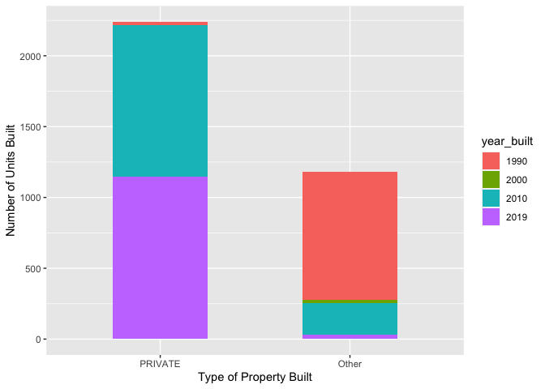

MiniDataAnalysis2
================
Giulia Belotti
2022-10-24

*To complete this milestone, you can edit [this `.rmd`
file](https://raw.githubusercontent.com/UBC-STAT/stat545.stat.ubc.ca/master/content/mini-project/mini-project-2.Rmd)
directly. Fill in the sections that are commented out with
`<!--- start your work here--->`. When you are done, make sure to knit
to an `.md` file by changing the output in the YAML header to
`github_document`, before submitting a tagged release on canvas.*

# Welcome to your second (and last) milestone in your mini data analysis project!

In Milestone 1, you explored your data, came up with research questions,
and obtained some results by making summary tables and graphs. This
time, we will first explore more in depth the concept of *tidy data.*
Then, you’ll be sharpening some of the results you obtained from your
previous milestone by:

- Manipulating special data types in R: factors and/or dates and times.
- Fitting a model object to your data, and extract a result.
- Reading and writing data as separate files.

**NOTE**: The main purpose of the mini data analysis is to integrate
what you learn in class in an analysis. Although each milestone provides
a framework for you to conduct your analysis, it’s possible that you
might find the instructions too rigid for your data set. If this is the
case, you may deviate from the instructions – just make sure you’re
demonstrating a wide range of tools and techniques taught in this class.

# Instructions

**To complete this milestone**, edit [this very `.Rmd`
file](https://raw.githubusercontent.com/UBC-STAT/stat545.stat.ubc.ca/master/content/mini-project/mini-project-2.Rmd)
directly. Fill in the sections that are tagged with
`<!--- start your work here--->`.

**To submit this milestone**, make sure to knit this `.Rmd` file to an
`.md` file by changing the YAML output settings from
`output: html_document` to `output: github_document`. Commit and push
all of your work to your mini-analysis GitHub repository, and tag a
release on GitHub. Then, submit a link to your tagged release on canvas.

**Points**: This milestone is worth 55 points (compared to the 45 points
of the Milestone 1): 45 for your analysis, and 10 for your entire
mini-analysis GitHub repository. Details follow.

**Research Questions**: In Milestone 1, you chose two research questions
to focus on. Wherever realistic, your work in this milestone should
relate to these research questions whenever we ask for justification
behind your work. In the case that some tasks in this milestone don’t
align well with one of your research questions, feel free to discuss
your results in the context of a different research question.

# Learning Objectives

By the end of this milestone, you should:

- Understand what *tidy* data is, and how to create it using `tidyr`.
- Generate a reproducible and clear report using R Markdown.
- Manipulating special data types in R: factors and/or dates and times.
- Fitting a model object to your data, and extract a result.
- Reading and writing data as separate files.

# Setup

Begin by loading your data and the tidyverse package below:

``` r
library(datateachr) # <- might contain the data you picked!
library(tidyverse)
```

# Task 1: Tidy your data (15 points)

In this task, we will do several exercises to reshape our data. The goal
here is to understand how to do this reshaping with the `tidyr` package.

A reminder of the definition of *tidy* data:

- Each row is an **observation**
- Each column is a **variable**
- Each cell is a **value**

*Tidy’ing* data is sometimes necessary because it can simplify
computation. Other times it can be nice to organize data so that it can
be easier to understand when read manually.

### 2.1 (2.5 points)

Based on the definition above, can you identify if your data is tidy or
untidy? Go through all your columns, or if you have \>8 variables, just
pick 8, and explain whether the data is untidy or tidy.

<!--------------------------- Start your work below --------------------------->

First, I will create a new dataset only considering my variables of
interest (\<8) and only considering observations after the year 1980.

``` r
apt_buildings_research <- as_tibble(apt_buildings) %>%
  filter(year_built > 1980) %>%
  select(year_built, balconies, barrier_free_accessibilty_entr, no_of_elevators, no_of_storeys, no_of_units, no_barrier_free_accessible_units, property_type)

print(apt_buildings_research)
```

    ## # A tibble: 393 × 8
    ##    year_built balconies barrier_free_a…¹ no_of…² no_of…³ no_of…⁴ no_ba…⁵ prope…⁶
    ##         <dbl> <chr>     <chr>              <dbl>   <dbl>   <dbl>   <dbl> <chr>  
    ##  1       1994 YES       YES                    3       6     106       4 SOCIAL…
    ##  2       2005 YES       NO                     2       9     116       0 PRIVATE
    ##  3       1992 YES       YES                    0       3      17       5 PRIVATE
    ##  4       2011 YES       YES                    2      10     153       2 PRIVATE
    ##  5       1984 NO        YES                    3      19     176       8 SOCIAL…
    ##  6       1995 YES       YES                    2      15     138       8 SOCIAL…
    ##  7       1994 NO        YES                    1       5      35       2 TCHC   
    ##  8       1994 YES       YES                    2       6      95       2 TCHC   
    ##  9       1986 YES       NO                     2      12     171       0 PRIVATE
    ## 10       1992 YES       YES                    1       6      16       0 SOCIAL…
    ## # … with 383 more rows, and abbreviated variable names
    ## #   ¹​barrier_free_accessibilty_entr, ²​no_of_elevators, ³​no_of_storeys,
    ## #   ⁴​no_of_units, ⁵​no_barrier_free_accessible_units, ⁶​property_type

Each row is an observation, each column is a variable, and each cell is
a value. Therefore, my data is tidy.

<!----------------------------------------------------------------------------->

### 2.2 (5 points)

Now, if your data is tidy, untidy it! Then, tidy it back to it’s
original state.

If your data is untidy, then tidy it! Then, untidy it back to it’s
original state.

Be sure to explain your reasoning for this task. Show us the “before”
and “after”.

<!--------------------------- Start your work below --------------------------->

Following, I untidy my data using pivot_wider. To do so, I had to mutate
property_type as character. I thought this would help me answer my
research question by making each type of property_type (private, social
housing, TCHC) a variable, but then I realized that with such dataset I
could not plot the three variables on an x-axis.

Therefore, I decided to tidy my data again using the pivot_longer
function.

``` r
apt_building_research_untidy <- apt_buildings_research %>%
  mutate(year_built = as.factor(year_built)) %>%
  mutate(property_type=as.character(property_type)) %>%
  group_by(property_type) %>%
  mutate(row = row_number()) %>%
  tidyr::pivot_wider(names_from = property_type, values_from = no_of_units) %>%
  select(-row) %>%
  arrange(year_built)

apt_buildings_research_tidy <- apt_building_research_untidy %>%
  pivot_longer(c('PRIVATE', 'SOCIAL HOUSING', 'TCHC'), names_to = "property_type", values_to = "no_of_units")
```

<!----------------------------------------------------------------------------->

### 2.3 (7.5 points)

Now, you should be more familiar with your data, and also have made
progress in answering your research questions. Based on your interest,
and your analyses, pick 2 of the 4 research questions to continue your
analysis in the next four tasks:

<!-------------------------- Start your work below ---------------------------->

1.  Many cities in North America are trying to add density in order to
    reduce GHG emissions by creating “walkable communities” or
    introducing neighborhood energy systems. Furthermore, many experts
    claim that adding more density will help tackling the housing
    affordability crisis. In light of this, how many units has the city
    of Toronto built per year since the 1980s?

2.  We are going to discuss affordability. Many experts claim that
    housing prices are not a result of demand and supply forces and thus
    prices will keep raising even if more units are built. Rather,
    cities need to build more social housing to face the affordability
    crisis. Has the city of Toronto built more social housing throughout
    the years?

<!----------------------------------------------------------------------------->

Explain your decision for choosing the above two research questions.

<!--------------------------- Start your work below --------------------------->

I chose the two research questions above for two reasons. First, I am
extremely interested in learning more about Toronto’s housing market,
both in terms of the number of units / number of storeys built each year
and in terms of the type of housing added to the housing market. Second,
I was able to identify interesting trends in the first part of the data
analysis. Therefore, I would like to explore those trends more in
details using the functions / coding learned in class.

<!----------------------------------------------------------------------------->

Now, try to choose a version of your data that you think will be
appropriate to answer these 2 questions. Use between 4 and 8 functions
that we’ve covered so far (i.e. by filtering, cleaning, tidy’ing,
dropping irrelevant columns, etc.).

<!--------------------------- Start your work below --------------------------->

To be able to further explore my research questions, I need a dataset
that has the following characteristics: - the following variables:
year_built, no_of_storeys, no_of_units, and property_type – all other
variables will be dropped - I will only consider observations after year
1980 - I will build three different datasets, one for each research
question and one for both of them combined

First step: Following, I am creating a new database for both research
question 1 and 2.

``` r
apt_buildings_q1q2 <- as_tibble(apt_buildings) %>%
  select(year_built, no_of_storeys, no_of_units, property_type)

print(apt_buildings_q1q2)
```

    ## # A tibble: 3,455 × 4
    ##    year_built no_of_storeys no_of_units property_type
    ##         <dbl>         <dbl>       <dbl> <chr>        
    ##  1       1967            17         218 PRIVATE      
    ##  2       1970            14         206 PRIVATE      
    ##  3       1927             4          34 PRIVATE      
    ##  4       1959             5          42 PRIVATE      
    ##  5       1943             4          25 PRIVATE      
    ##  6       1952             4          34 PRIVATE      
    ##  7       1959             4          14 PRIVATE      
    ##  8       1971             7         105 PRIVATE      
    ##  9       1969            32         571 PRIVATE      
    ## 10       1972             4         171 TCHC         
    ## # … with 3,445 more rows

Second step: I am not interested in observations before 1980. I will
therefore filter by year and create a new tibble containing observations
starting from year 1980.

``` r
apt_buildings_q1q2_1980 <- as_tibble(apt_buildings) %>%
  filter(year_built > 1980) %>%
  select(year_built, no_of_storeys, no_of_units, property_type)

print(apt_buildings_q1q2_1980)
```

    ## # A tibble: 393 × 4
    ##    year_built no_of_storeys no_of_units property_type 
    ##         <dbl>         <dbl>       <dbl> <chr>         
    ##  1       1994             6         106 SOCIAL HOUSING
    ##  2       2005             9         116 PRIVATE       
    ##  3       1992             3          17 PRIVATE       
    ##  4       2011            10         153 PRIVATE       
    ##  5       1984            19         176 SOCIAL HOUSING
    ##  6       1995            15         138 SOCIAL HOUSING
    ##  7       1994             5          35 TCHC          
    ##  8       1994             6          95 TCHC          
    ##  9       1986            12         171 PRIVATE       
    ## 10       1992             6          16 SOCIAL HOUSING
    ## # … with 383 more rows

Third step: I want to order the variable “year_built” in ascendant order
and then also in descending order.

``` r
apt_buildings_q1q2_1980 %>%
  arrange(year_built)
```

    ## # A tibble: 393 × 4
    ##    year_built no_of_storeys no_of_units property_type 
    ##         <dbl>         <dbl>       <dbl> <chr>         
    ##  1       1981             8         139 TCHC          
    ##  2       1981             7         195 PRIVATE       
    ##  3       1981             7          53 SOCIAL HOUSING
    ##  4       1981            14         300 TCHC          
    ##  5       1981             7         247 TCHC          
    ##  6       1981            32         147 PRIVATE       
    ##  7       1981            15         266 TCHC          
    ##  8       1982            14         256 PRIVATE       
    ##  9       1982            10         174 SOCIAL HOUSING
    ## 10       1982             9         117 PRIVATE       
    ## # … with 383 more rows

``` r
apt_buildings_q1q2_1980 %>%
  arrange(desc(year_built))
```

    ## # A tibble: 393 × 4
    ##    year_built no_of_storeys no_of_units property_type 
    ##         <dbl>         <dbl>       <dbl> <chr>         
    ##  1       2019            36         466 PRIVATE       
    ##  2       2019            17         146 PRIVATE       
    ##  3       2019             4          30 SOCIAL HOUSING
    ##  4       2019            27         301 PRIVATE       
    ##  5       2019            27         235 PRIVATE       
    ##  6       2018            51         502 PRIVATE       
    ##  7       2018            43         369 PRIVATE       
    ##  8       2018             7          77 TCHC          
    ##  9       2018            31         369 PRIVATE       
    ## 10       2017             8          46 PRIVATE       
    ## # … with 383 more rows

I am now going to create a dataset to answer Research Question 1. This
will include 3 variables (year_built, no_of_storeys, no_of_units). This
time, I am using the function subset to drop one variable, namely the
variable “property_type”.

``` r
apt_buildings_q1 <- apt_buildings_q1q2 %>%
  subset(select = -c(property_type))

apt_buildings_q1
```

    ## # A tibble: 3,455 × 3
    ##    year_built no_of_storeys no_of_units
    ##         <dbl>         <dbl>       <dbl>
    ##  1       1967            17         218
    ##  2       1970            14         206
    ##  3       1927             4          34
    ##  4       1959             5          42
    ##  5       1943             4          25
    ##  6       1952             4          34
    ##  7       1959             4          14
    ##  8       1971             7         105
    ##  9       1969            32         571
    ## 10       1972             4         171
    ## # … with 3,445 more rows

I am not happy with the fact that my dataset includes years_built before
1980. To answer my research question, I am not interested in
observations after that year. Also, I am going to order observations in
ascendant order, both for the variable “year_built” and “no_of_units”.

``` r
apt_buildings_q1_1980 <- apt_buildings_q1 %>%
  filter(year_built > 1980) %>%
    arrange(year_built, no_of_units)

print(apt_buildings_q1_1980)
```

    ## # A tibble: 393 × 3
    ##    year_built no_of_storeys no_of_units
    ##         <dbl>         <dbl>       <dbl>
    ##  1       1981             7          53
    ##  2       1981             8         139
    ##  3       1981            32         147
    ##  4       1981             7         195
    ##  5       1981             7         247
    ##  6       1981            15         266
    ##  7       1981            14         300
    ##  8       1982             3          18
    ##  9       1982            11          60
    ## 10       1982             3          61
    ## # … with 383 more rows

Last but not least, I am going to use the same functions to create a
dataset that would help me answer Research Question 2.

``` r
apt_buildings_q2 <- apt_buildings_q1q2 %>%
  subset(select = -c(no_of_storeys, no_of_units))

apt_buildings_q2
```

    ## # A tibble: 3,455 × 2
    ##    year_built property_type
    ##         <dbl> <chr>        
    ##  1       1967 PRIVATE      
    ##  2       1970 PRIVATE      
    ##  3       1927 PRIVATE      
    ##  4       1959 PRIVATE      
    ##  5       1943 PRIVATE      
    ##  6       1952 PRIVATE      
    ##  7       1959 PRIVATE      
    ##  8       1971 PRIVATE      
    ##  9       1969 PRIVATE      
    ## 10       1972 TCHC         
    ## # … with 3,445 more rows

``` r
apt_buildings_q2_1980 <- apt_buildings_q2 %>%
  filter(year_built > 1980) %>%
    arrange(year_built)

print(apt_buildings_q2_1980)
```

    ## # A tibble: 393 × 2
    ##    year_built property_type 
    ##         <dbl> <chr>         
    ##  1       1981 TCHC          
    ##  2       1981 PRIVATE       
    ##  3       1981 SOCIAL HOUSING
    ##  4       1981 TCHC          
    ##  5       1981 TCHC          
    ##  6       1981 PRIVATE       
    ##  7       1981 TCHC          
    ##  8       1982 PRIVATE       
    ##  9       1982 SOCIAL HOUSING
    ## 10       1982 PRIVATE       
    ## # … with 383 more rows

``` r
apt_buildings_q2_1980 %>%
  group_by(property_type == "SOCIAL HOUSING")
```

    ## # A tibble: 393 × 3
    ## # Groups:   property_type == "SOCIAL HOUSING" [2]
    ##    year_built property_type  `property_type == "SOCIAL HOUSING"`
    ##         <dbl> <chr>          <lgl>                              
    ##  1       1981 TCHC           FALSE                              
    ##  2       1981 PRIVATE        FALSE                              
    ##  3       1981 SOCIAL HOUSING TRUE                               
    ##  4       1981 TCHC           FALSE                              
    ##  5       1981 TCHC           FALSE                              
    ##  6       1981 PRIVATE        FALSE                              
    ##  7       1981 TCHC           FALSE                              
    ##  8       1982 PRIVATE        FALSE                              
    ##  9       1982 SOCIAL HOUSING TRUE                               
    ## 10       1982 PRIVATE        FALSE                              
    ## # … with 383 more rows

Now, as my final operation, I am going to find the average of storeys
and the average of units built each year from 1980 to 2019. I will use
the functions summarize() and across(). I might want to plot this later,
since I think it would allow me to better visualize my data.

``` r
apt_buildings_q1_1980 %>% 
  group_by(year_built) %>% 
  summarise(across(c(no_of_storeys, no_of_units), mean))
```

    ## # A tibble: 38 × 3
    ##    year_built no_of_storeys no_of_units
    ##         <dbl>         <dbl>       <dbl>
    ##  1       1981         12.9        192. 
    ##  2       1982          9.65       147. 
    ##  3       1983          9.93       146. 
    ##  4       1984         12          156. 
    ##  5       1985          7.5         97.1
    ##  6       1986         11.4        155  
    ##  7       1987          8.92       117. 
    ##  8       1988          5.73        77.7
    ##  9       1989          6.64        90.4
    ## 10       1990          5.54        71.5
    ## # … with 28 more rows

<!----------------------------------------------------------------------------->

# Task 2: Special Data Types (10)

For this exercise, you’ll be choosing two of the three tasks below –
both tasks that you choose are worth 5 points each.

But first, tasks 1 and 2 below ask you to modify a plot you made in a
previous milestone. The plot you choose should involve plotting across
at least three groups (whether by facetting, or using an aesthetic like
colour). Place this plot below (you’re allowed to modify the plot if
you’d like). If you don’t have such a plot, you’ll need to make one.
Place the code for your plot below.

<!-------------------------- Start your work below ---------------------------->

None of the plots I made in the first data analysis makes sense for this
exercise, since I didn’t have any categorical variables on the x-axis.
Therefore, I decided to take advantage of this to create a new plot that
could help me answer Research Question 2. On the x-axis, there is the
property type (social housing, private, or TCHC), while on the y-axis
there is the number of units. Colors indicate 4 different years. Years
were chosen as reference points to understand how - if so - the type of
property built has changed throughout the years. Although not
representing the most intuitive plot, it allows me to complete the
exercises proposed in this assignment.

``` r
apt_buildings_new <- apt_buildings_q1q2_1980 %>%
  filter(year_built %in% c(1990, 2000, 2010, 2019)) %>%
  mutate(year_built=as.factor(year_built))

apt_buildings_new %>%
ggplot() +
  geom_bar(aes(x = property_type, y = no_of_units, fill = year_built), stat = "identity", width = 0.5) +
  labs(title = "Types of Property Built in Specific Years") +
  ylab("Number of Units Built") +
  xlab("Type of Property Built") 
```

<!-- -->

<!----------------------------------------------------------------------------->

Now, choose two of the following tasks.

1.  Produce a new plot that reorders a factor in your original plot,
    using the `forcats` package (3 points). Then, in a sentence or two,
    briefly explain why you chose this ordering (1 point here for
    demonstrating understanding of the reordering, and 1 point for
    demonstrating some justification for the reordering, which could be
    subtle or speculative.)

2.  Produce a new plot that groups some factor levels together into an
    “other” category (or something similar), using the `forcats` package
    (3 points). Then, in a sentence or two, briefly explain why you
    chose this grouping (1 point here for demonstrating understanding of
    the grouping, and 1 point for demonstrating some justification for
    the grouping, which could be subtle or speculative.)

3.  If your data has some sort of time-based column like a date (but
    something more granular than just a year):

    1.  Make a new column that uses a function from the `lubridate` or
        `tsibble` package to modify your original time-based column. (3
        points)

        - Note that you might first have to *make* a time-based column
          using a function like `ymd()`, but this doesn’t count.
        - Examples of something you might do here: extract the day of
          the year from a date, or extract the weekday, or let 24 hours
          elapse on your dates.

    2.  Then, in a sentence or two, explain how your new column might be
        useful in exploring a research question. (1 point for
        demonstrating understanding of the function you used, and 1
        point for your justification, which could be subtle or
        speculative).

        - For example, you could say something like “Investigating the
          day of the week might be insightful because penguins don’t
          work on weekends, and so may respond differently”.

<!-------------------------- Start your work below ---------------------------->

**Task Number**: 1 - Produce a new plot that reorders a factor in your
original plot.

By using the function fct_infreq(), I reorder levels by the frequency in
which they appear in the data, with the highest frequency first. This
allows me to understand, in absolute numbers and not in relative numbers
(e.g, by year) what is the type of housing that has been built the most.
In this case, I see that private housing is the type of housing that has
been mostly built in absolute numbers (in total, basically the sum of
the 4 years considered), followed by TCHC and social housing.

``` r
apt_buildings_new %>%
  mutate(property_type = fct_infreq(property_type)) %>%
ggplot() +
  geom_bar(aes(x = property_type, y = no_of_units, fill = year_built), stat = "identity", width = 0.5) +
  labs(title = "Types of Property Built in Specific Years") +
  ylab("Number of Units Built") +
  xlab("Type of Property Built") 
```

<!-- -->

<!----------------------------------------------------------------------------->
<!-------------------------- Start your work below ---------------------------->

**Task Number**: 2 - Produce a new plot that groups some factor levels
together into an “other” category.

I used the function fct_other to group “social housing” and “TCHC”
together. I did so because TCHC is also a type of social housing, so I
wanted to get a sense of how many private vs. social houses were built
in my selected year. This yields very interesting results, clearly
showing that more social housing was built in the past, while more
private housing is built now (2010 and 2019).

``` r
#Property type needs to be a character, otherwise code won't work

apt_buildings_new %>%
mutate(property_type=as.character(property_type))
```

    ## # A tibble: 28 × 4
    ##    year_built no_of_storeys no_of_units property_type 
    ##    <fct>              <dbl>       <dbl> <chr>         
    ##  1 1990                   3          15 PRIVATE       
    ##  2 1990                   6          75 SOCIAL HOUSING
    ##  3 2019                  36         466 PRIVATE       
    ##  4 2019                  17         146 PRIVATE       
    ##  5 1990                   7          73 TCHC          
    ##  6 2000                   7          25 TCHC          
    ##  7 1990                   9         207 TCHC          
    ##  8 1990                   3          10 PRIVATE       
    ##  9 2010                  22         332 PRIVATE       
    ## 10 2010                   7          74 PRIVATE       
    ## # … with 18 more rows

``` r
#As in the first exercise, pivot_wider won't work unless I create a unique identifier row for each name. Please do not mind the following code, I am playing around with the data to then be able to plot it. 

apt_buildings_property_type <- apt_buildings_new %>%
  group_by(property_type) %>%
  mutate(row = row_number()) %>%
  tidyr::pivot_wider(names_from = property_type, values_from = no_of_units) %>%
  select(-row) %>%
  arrange(year_built) %>%
  subset(select = -c(no_of_storeys))

apt_buildings_property_tidy <- apt_buildings_property_type %>%
  pivot_longer(c('PRIVATE', 'SOCIAL HOUSING', 'TCHC'), names_to = "property_type", values_to = "no_of_units")

#Plotting data producing an "other" category. 

apt_buildings_property_tidy %>%
ggplot() +
  geom_bar(aes(x = fct_other(property_type, keep = c("PRIVATE"), other_level = "Other"), y = no_of_units, fill = year_built), stat = "identity", width = 0.5) +
  ylab("Number of Units Built") +
  xlab("Type of Property Built") 
```

    ## Warning: Removed 56 rows containing missing values (position_stack).

<!-- -->

<!----------------------------------------------------------------------------->

# Task 3: Modelling

## 2.0 (no points)

Pick a research question, and pick a variable of interest (we’ll call it
“Y”) that’s relevant to the research question. Indicate these.

<!-------------------------- Start your work below ---------------------------->

**Research Question**: Many cities in North America are trying to add
density in order to reduce GHG emissions by creating “walkable
communities” or introducing neighborhood energy systems. Furthermore,
many experts claim that adding more density will help tackling the
housing affordability crisis. In light of this, how many units has the
city of Toronto built per year since the 1980s?

**Variable of interest**: no_of_units

<!----------------------------------------------------------------------------->

## 2.1 (5 points)

Fit a model or run a hypothesis test that provides insight on this
variable with respect to the research question. Store the model object
as a variable, and print its output to screen. We’ll omit having to
justify your choice, because we don’t expect you to know about model
specifics in STAT 545.

- **Note**: It’s OK if you don’t know how these models/tests work. Here
  are some examples of things you can do here, but the sky’s the limit.

  - You could fit a model that makes predictions on Y using another
    variable, by using the `lm()` function.
  - You could test whether the mean of Y equals 0 using `t.test()`, or
    maybe the mean across two groups are different using `t.test()`, or
    maybe the mean across multiple groups are different using `anova()`
    (you may have to pivot your data for the latter two).
  - You could use `lm()` to test for significance of regression.

<!-------------------------- Start your work below ---------------------------->

``` r
expected_no_units_trend <- lm(no_of_units ~ year_built, apt_buildings_q1_1980)
print(expected_no_units_trend)
```

    ## 
    ## Call:
    ## lm(formula = no_of_units ~ year_built, data = apt_buildings_q1_1980)
    ## 
    ## Coefficients:
    ## (Intercept)   year_built  
    ##   -6366.715        3.254

<!----------------------------------------------------------------------------->

## 2.2 (5 points)

Produce something relevant from your fitted model: either predictions on
Y, or a single value like a regression coefficient or a p-value.

- Be sure to indicate in writing what you chose to produce.
- Your code should either output a tibble (in which case you should
  indicate the column that contains the thing you’re looking for), or
  the thing you’re looking for itself.
- Obtain your results using the `broom` package if possible. If your
  model is not compatible with the broom function you’re needing, then
  you can obtain your results by some other means, but first indicate
  which broom function is not compatible.

<!-------------------------- Start your work below ---------------------------->

I am going to produce a p-value using the broom package. Before doing
that, I want all the years in the data set relative to the year 1990.

``` r
expected_no_units_relative <- lm(no_of_units ~ I(year_built-1990), apt_buildings_q1_1980)
print(expected_no_units_relative)
```

    ## 
    ## Call:
    ## lm(formula = no_of_units ~ I(year_built - 1990), data = apt_buildings_q1_1980)
    ## 
    ## Coefficients:
    ##          (Intercept)  I(year_built - 1990)  
    ##              108.524                 3.254

``` r
library(broom)

expected_no_units_pvalue <- tidy(expected_no_units_relative)
print(expected_no_units_pvalue)
```

    ## # A tibble: 2 × 5
    ##   term                 estimate std.error statistic  p.value
    ##   <chr>                   <dbl>     <dbl>     <dbl>    <dbl>
    ## 1 (Intercept)            109.       12.3       8.83 3.51e-17
    ## 2 I(year_built - 1990)     3.25      1.05      3.09 2.16e- 3

<!----------------------------------------------------------------------------->

# Task 4: Reading and writing data

Get set up for this exercise by making a folder called `output` in the
top level of your project folder / repository. You’ll be saving things
there.

## 3.1 (5 points)

Take a summary table that you made from Milestone 1 (Task 4.2), and
write it as a csv file in your `output` folder. Use the `here::here()`
function.

- **Robustness criteria**: You should be able to move your Mini Project
  repository / project folder to some other location on your computer,
  or move this very Rmd file to another location within your project
  repository / folder, and your code should still work.
- **Reproducibility criteria**: You should be able to delete the csv
  file, and remake it simply by knitting this Rmd file.

<!-------------------------- Start your work below ---------------------------->

``` r
output_exercise <- apt_buildings %>% 
group_by(year_built) %>% 
summarise (no_of_units_sd = sd(no_of_units, na.rm = TRUE)) %>%
print()
```

    ## # A tibble: 128 × 2
    ##    year_built no_of_units_sd
    ##         <dbl>          <dbl>
    ##  1       1805          NA   
    ##  2       1809          NA   
    ##  3       1838          NA   
    ##  4       1880          NA   
    ##  5       1885           6.36
    ##  6       1888          NA   
    ##  7       1890          NA   
    ##  8       1891          NA   
    ##  9       1895          NA   
    ## 10       1896          NA   
    ## # … with 118 more rows

``` r
here::here()
```

    ## [1] "/Users/giuliabelotti/Desktop/MiniDataAnalysis/MiniDataAnalysis_GiuliaBelotti"

``` r
write_csv(output_exercise, here::here("output", "outputexercise.csv")) 
```

<!----------------------------------------------------------------------------->

## 3.2 (5 points)

Write your model object from Task 3 to an R binary file (an RDS), and
load it again. Be sure to save the binary file in your `output` folder.
Use the functions `saveRDS()` and `readRDS()`.

- The same robustness and reproducibility criteria as in 3.1 apply here.

<!-------------------------- Start your work below ---------------------------->

``` r
saveRDS(expected_no_units_trend, here::here("output", "expectedunitstrend.rds"))

rdsmodel <- readRDS(here::here("output", "expectedunitstrend.rds"))
rdsmodel
```

    ## 
    ## Call:
    ## lm(formula = no_of_units ~ year_built, data = apt_buildings_q1_1980)
    ## 
    ## Coefficients:
    ## (Intercept)   year_built  
    ##   -6366.715        3.254

<!----------------------------------------------------------------------------->

# Tidy Repository

Now that this is your last milestone, your entire project repository
should be organized. Here are the criteria we’re looking for.

## Main README (3 points)

There should be a file named `README.md` at the top level of your
repository. Its contents should automatically appear when you visit the
repository on GitHub.

Minimum contents of the README file:

- In a sentence or two, explains what this repository is, so that
  future-you or someone else stumbling on your repository can be
  oriented to the repository.
- In a sentence or two (or more??), briefly explains how to engage with
  the repository. You can assume the person reading knows the material
  from STAT 545A. Basically, if a visitor to your repository wants to
  explore your project, what should they know?

Once you get in the habit of making README files, and seeing more README
files in other projects, you’ll wonder how you ever got by without them!
They are tremendously helpful.

## File and Folder structure (3 points)

You should have at least four folders in the top level of your
repository: one for each milestone, and one output folder. If there are
any other folders, these are explained in the main README.

Each milestone document is contained in its respective folder, and
nowhere else.

Every level-1 folder (that is, the ones stored in the top level, like
“Milestone1” and “output”) has a `README` file, explaining in a sentence
or two what is in the folder, in plain language (it’s enough to say
something like “This folder contains the source for Milestone 1”).

## Output (2 points)

All output is recent and relevant:

- All Rmd files have been `knit`ted to their output, and all data files
  saved from Task 4 above appear in the `output` folder.
- All of these output files are up-to-date – that is, they haven’t
  fallen behind after the source (Rmd) files have been updated.
- There should be no relic output files. For example, if you were
  knitting an Rmd to html, but then changed the output to be only a
  markdown file, then the html file is a relic and should be deleted.

Our recommendation: delete all output files, and re-knit each
milestone’s Rmd file, so that everything is up to date and relevant.

PS: there’s a way where you can run all project code using a single
command, instead of clicking “knit” three times. More on this in STAT
545B!

## Error-free code (1 point)

This Milestone 1 document knits error-free, and the Milestone 2 document
knits error-free.

## Tagged release (1 point)

You’ve tagged a release for Milestone 1, and you’ve tagged a release for
Milestone 2.

### Attribution

Thanks to Victor Yuan for mostly putting this together.
